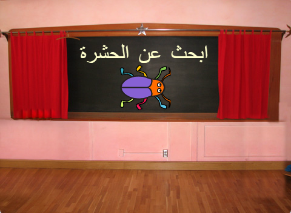
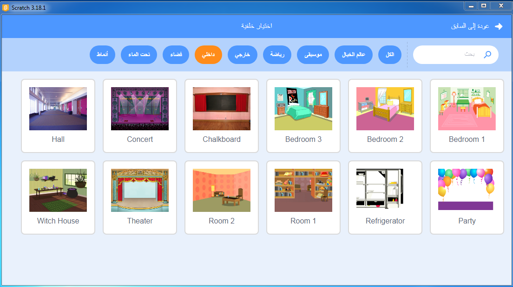
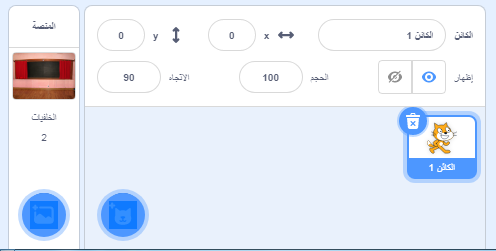
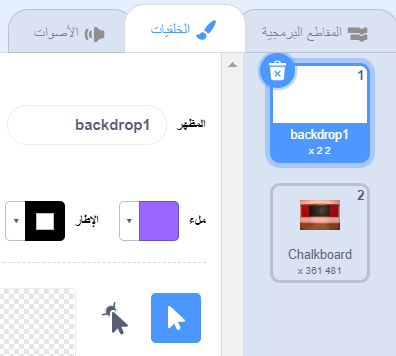
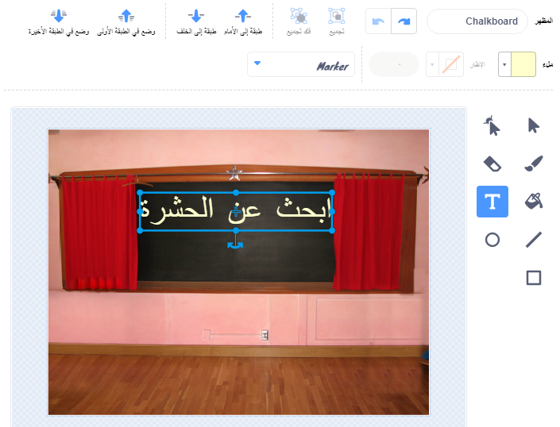
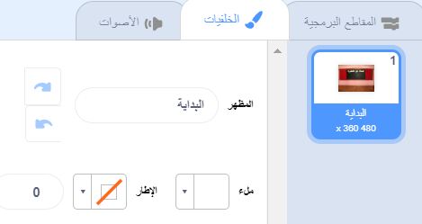
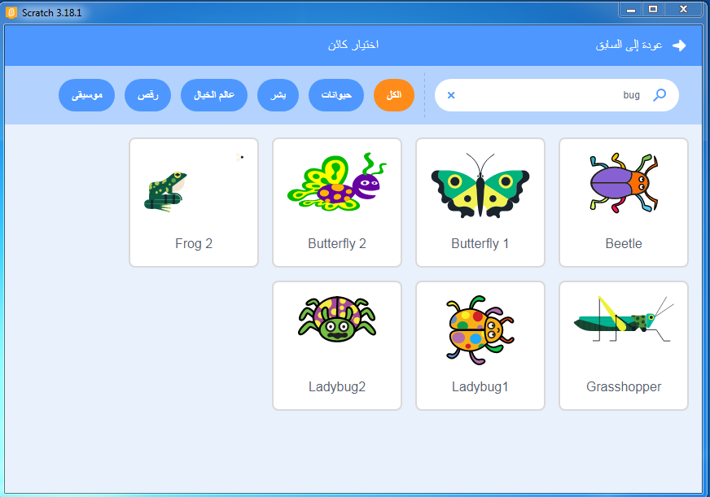

## Start screen

Your game will begin with a 'start' screen, and players will click on the bug to go to the first level.

{:width="300px"}

--- task ---

Open a [new Scratch project](https://rpf.io/scratch-new){:target="_blank"}. Scratch will open in another browser tab.

[[[working-offline]]] --- /task ---

--- task ---

Add the **Chalkboard** backdrop from the **Indoors** category.

--- /task ---

The **Stage** has a **Backdrops** tab instead of a **Costumes** tab. This is where you can create images for the **Stage**.

--- task --- Click on the Stage pane.

--- /task ---

--- task ---

Click on the **Backdrops** tab to open the Paint editor.

--- /task ---

--- task ---

Select **backdrop1** and click on the **Delete** icon to remove the **backdrop1** backdrop from your project. You will not need it in this project.

--- /task ---

The **Chalkboard** backdrop will now be highlighted.

--- task ---

Click on **Convert to Vector**. This will allow you to add text that you can move around.

--- /task ---

--- task ---

Use the **Text** tool to add the text `Find the bug` to the chalkboard:

We used the **Marker** font in white, but **choose** your favourite font and colour.

**Tip:** Switch to the **Select (Arrow)** tool to move your text around. To change the size of the text, grab the corner of the text and drag it.

--- /task ---

--- task ---

Change the name of the backdrop to `start`, because you will need to select it later in the project.

**Tip:** Using names that make sense will help you understand your project, especially when you come back to a project later.

--- /task ---

--- task ---

Delete the **Scratch Cat** sprite.

--- /task ---

--- task ---

Click on **Choose a Sprite** and type `bug` in the search box.

**Choose:** Choose a bug for players to find in your game.

**Tip:** Give your project a name. You might like to include the name of the bug that you have just chosen.

--- /task ---

A mistake in a computer program is called a **bug**. Finding and removing mistakes in computer programs is called **debugging**. Grace Hopper is a famous software engineer. Her team once found a moth in their computer. Their notes say, "First actual case of bug being found."

--- save ---

