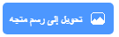

## شاشة البداية

امنح لعبتك شاشة "البَدْء".

!نص["اعثر على الحشرة" على السبورة ضمن المنصة.](images/start-screen.png){:width="300px"}

### افتح مشروع البداية

--- task ---

افتح [مشروع البداية اعثر على الحشرة](https://scratch.mit.edu/projects/582214723/editor){:target="_blank"}. سيتم فتح Scratch في علامة تبويب متصفح أخرى.

[[[working-offline]]]

--- /task ---

### إضافة خلفية

--- task ---

أضف خلفية **السَّبُّورَة** من القسم **الداخلي**.

--- /task ---

تحتوي **المنصة** على علامة تبويب **صور خلفيات** بدلاً من علامة تبويب **المظاهر**. هذا هو المكان الذي يمكنك فيه إنشاء صور من أجل **المنصة**.

--- task ---

انقر على لوحة المنصة.

--- /task ---

### التعديل على الصور الخلفية

--- task ---

انقر فوق علامة تبويب **الخلفيات** لفتح محرر الرسام.

--- /task ---

--- task ---

حدد **خلفية 1** وانقر على أيقونة **حذف** لإزالة الخلفية **خلفية 1** من مشروعك. لن تحتاج إلى الخلفية **خلفية 1** في هذا المشروع.

--- /task ---

سيتم الآن تمييز خلفية **السبورة**.

--- task ---

انقر فوق **تحويل إلى رسم متجه**. الآن، ستتمكن من إضافة نص تستطيع تحريكه.

--- /task ---

--- task ---

استخدم أداة **نص** لإضافة النص `ابحث عن الحشرة` إلى السبورة:

استخدمنا خط **علامة** باللون الأبيض، لكن **اختر** الخط واللون اللذين تريد استخدامهما.

**نصيحة:** قم بالتبديل إلى أداة **انتقِ** (Arrow) Select لتحريك النص الخاص بك. لتغيير حجم النص، اسحب زاوية مربع النص واسحبه.

--- /task ---

## إعادة تسمية الخلفية

--- task ---

قم بتغيير اسم الخلفية إلى `البداية`، لأنك ستحتاج إلى اختيارها لاحقًا في المشروع.

**نصيحة:** إذا كنت تستخدم أسماء منطقية ذات معنى، فسيكون من السهل فهم مشروعك، خاصةً عند العودة إلى المشروع لاحقًا.

--- /task ---

### أضف كائن الحشرة

--- task ---

احذف الكائن **قطة**Scratch.

--- /task ---

--- task ---

انقر فوق **اختيار كائن** واكتب `bug` في مربع البحث.

**اختر:** اختيار الحشرة التي سيحتاج اللاعبون إلى العثور عليها في لعبتك.

**نصيحة:** امنح مشروعك اسمًا. قد ترغب في تضمين اسم الحشرة الذي اخترته للتو.

--- /task ---

يسمى الخطأ في برنامج الكمبيوتر **bug**. يُطلق على البحث عن الأخطاء وإزالتها في برامج الكمبيوتر **debugging**. جريس هوبر "Grace Hopper" هي مهندسة برمجيات مشهورة. وجد فريقها ذات مرة فراشة في جهاز الكمبيوتر الخاص بهم. تقول ملاحظاتهم ، "تم العثور على أول حالة فعلية لحشرة"

