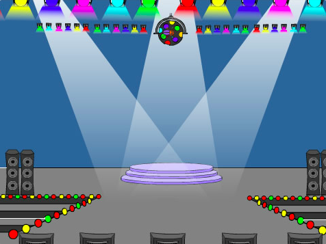
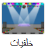
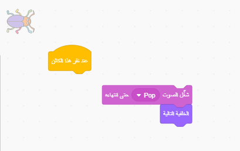

## المستوى الأول

<div style="display: flex; flex-wrap: wrap">
<div style="flex-basis: 200px; flex-grow: 1; margin-right: 15px;">
ستضيف خلفية جديدة كأول مستوى في لعبتك، و أخفي الحشرة.
</div>
<div>

{:width="300px"}

</div>
</div>

### أضف خلفية أخرى

--- task ---

أضف خلفية **أضواء المسرح** من فئة **الموسيقا**.


--- /task ---

### تغيير حجم كائن الحشرة

--- task ---

انقر فوق الكائن **حشرة** في قائمة الكائن. أضف نصاً لتغيير `حجم`{:class="block3looks"} الحشرة `عندما تتغير خلفية أضواء المسرح`{:class="block3events"}:


```blocks3
when backdrop switches to [Spotlight v]
set size to [20] % // tiny
```

--- /task ---

--- task ---

انقر فوق الرمز لتغيير الحجم ، ثم اسحب الحشرة الصغيرة إلى مكان للاختباء.

أضف تعليمات برمجية لموضع الحشرة الخاصة بك:


```blocks3
when backdrop switches to [Spotlight v]
set size to [20] % // tiny
+ go to x: [13] y: [132] // on the disco ball
```

**اختر:** يمكنك اختيار حجم وموقع مختلفين، إذا كنت تفضل ذلك.

--- /task ---

### الانتقال إلى الصورة الخلفية التالية

عندما تلعب اللعبة وتجد الحشرة بنجاح، ستنتقل اللعبة إلى الخلفية التالية. أيضًا، لبدء اللعبة، يمكنك الضغط على الحشرة في شاشة "ابدأ".

الوحدة `الخلفية التالية`{: class = "block3looks"} تتغير إلى الخلفية التالية بالترتيب الذي يتم به وضع الخلفيات عند النقر فوق علامة التبويب **الخلفيات** من أجل **المنصة**.

--- task ---

أضف برنامجًا نصيًا إلى كائن **الحشرة** وذلك ل`تشغيل صوت موسيقى البوب` والتبديل إلى `الخلفية التالية`{:class="block3looks"}`عند النقر على هذا الكائن`{:class="block3events"}:


```blocks3
when this sprite clicked
play sound [Pop v] until done
next backdrop
```

--- /task ---

### اجعل اللعبة تبدأ بشاشة البدء

--- task ---

انقر فوق لوحة المنصة وأضف هذه التعليمات البرمجية إلى **المنصة**:



```blocks3
when flag clicked
switch backdrop to [start v] // 'start' screen
```

--- /task ---

--- task ---

**اختبار:** انقر فوق العلم الأخضر لاختبار مشروعك.

ستلاحظ أنه في شاشة "البداية"، ستظل الحشرة تحتوي على الإعدادات للاختباء في مكان اختبائها من المستوى الأول (في هذا المثال، على كرة الديسكو).

**نصيحة:** بعد الخلفية الأخيرة في القائمة، `الخلفية التالية`{:class="block3looks"} ستعود إلى الخلفية الأولى.

--- /task ---

--- task ---

انقر فوق الكائن **حشرة** في قائمة الكائن. أضف نصاً لتغيير `حجم`{:class="block3looks"} الحشرة `عندما تتغير خلفية أضواء المسرح`{:class="block3events"}:


```blocks3
when backdrop switches to [start v]
set size to [100] % // full-sized
```

--- /task ---

### قم بتغيير موضع الحشرة

--- task ---

حاول وضع الحشرة على شاشة "البداية".

سيقوم البرنامج الخاص بك بتبديل الخلفية عند النقر فوق الحشرة! هذا ليس مفيدًا عندما تحاول تحديد موقع الحشرة.

لإصلاح المشكلة، تحتاج إلى إيقاف تشغيل البرنامج عند النقر فوق الحشرة.

--- /task ---

--- task ---

انقر فوق العلم الأخضر للعودة إلى شاشة "البداية".

انقر على كائن **الحشرة** في قائمة الكائنات واسحب الوحدات بعيداً عن وحدة `عند النقر على هذا الكائن`{:class="block3events"}:



--- /task ---

--- task ---

حاول وضع الحشرة مرة أخرى. اسحب الحشرة على السَّبُّورَة، أسفل النص:


أضف تعليمات برمجية للتأكد من وضع الحشرة على السَّبُّورَة في كل مرة يتم فيها `تبديل الخلفية إلى`{:class="block3events"} شاشة`البداية`{:class="block3events"}:


```blocks3
when backdrop switches to [start v]
set size to [100] % // full-sized
+ go to x: [0] y: [30] // on the board
```

--- /task ---

--- task ---

قم بجمع الوحدات معًا مرة أخرى بحيث تكون وحدات التعليمات البرمجية تحت وحدة `عند نقر هذا الكائن`{:class="block3events"} مرة أخرى:


--- /task ---

--- task ---

**اختبار:** انقر فوق العلم الأخضر لاختبار مشروعك. انقر فوق الحشرة للانتقال إلى الخلفية التالية. يجب أن تكون الحشرة كبيرة على شاشة "البداية" وصغيرة على مستوى خلفية "أضواء المسرح".

--- collapse ---
---
العنوان: لا شيء يحدث عندما أنقر على الحشرة
---

هل نسيت ضم البرنامَج مرة أخرى إلى وحدة `عند نقر هذا الكائن`{:class="block3events"}؟

--- /collapse ---

--- /task ---