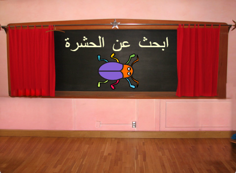

## المستوى الأول

<div style="display: flex; flex-wrap: wrap">
<div style="flex-basis: 200px; flex-grow: 1; margin-right: 15px;">
Add a new backdrop as the first level in your game, and hide the bug.
</div>
<div>

{:width="300px"}

</div>
</div>

### Add another Backdrop

--- task ---

أضف خلفية **أضواء المسرح** من فئة **الموسيقا**.


--- /task ---

### Resize the bug

--- task ---

انقر فوق الكائن **حشرة** في قائمة الكائن. أضف نصاً لتغيير `حجم`{:class="block3looks"} الحشرة `عندما تتغير خلفية أضواء المسرح`{:class="block3events"}:


```blocks3
when backdrop switches to [Spotlight v]
set size to [20] % // tiny
```

--- /task ---

--- task ---

انقر فوق الرمز لتغيير الحجم ، ثم اسحب الحشرة الصغيرة إلى مكان للاختباء.

أضف تعليمات برمجية لموضع الحشرة الخاصة بك:


```blocks3
when backdrop switches to [Spotlight v]
set size to [20] % // tiny
+ go to x: [13] y: [132] // on the disco ball
```

**اختر:** يمكنك اختيار حجم وموقع مختلفين، إذا كنت تفضل ذلك.

--- /task ---

### Move to the next Backdrop

عندما تلعب اللعبة وتجد الحشرة بنجاح، ستنتقل اللعبة إلى الخلفية التالية. أيضًا، لبدء اللعبة، يمكنك الضغط على الحشرة في شاشة "ابدأ".

الوحدة `الخلفية التالية`{: class = "block3looks"} تتغير إلى الخلفية التالية بالترتيب الذي يتم به وضع الخلفيات عند النقر فوق علامة التبويب **الخلفيات** من أجل **المنصة**.

--- task ---

أضف برنامجًا نصيًا إلى كائن **الحشرة** وذلك ل`تشغيل صوت موسيقى البوب` والتبديل إلى `الخلفية التالية`{:class="block3looks"}`عند النقر على هذا الكائن`{:class="block3events"}:


```blocks3
when this sprite clicked
play sound [Pop v] until done
next backdrop
```

--- /task ---

### Make the game start with the Start Screen

--- task ---

Click on the Stage pane and add this code to the **Stage**:


```blocks3
when flag clicked
switch backdrop to [start v] // 'start' screen
```

--- /task ---

--- task ---

**Test:** Click on the green flag to test your project.

You will notice that on the 'start' screen, the bug will still have the settings to hide in its hiding place from the first level (in this example, on the disco ball).

**Tip:** After the last backdrop in the list, `next backdrop`{:class="block3looks"} will switch back to the first backdrop.

--- /task ---

--- task ---

Click on the **bug** sprite in the Sprite list. Add a script to `set the size`{:class="block3looks"} of the bug when your `backdrop switches to`{:class="block3events"} the `start`{:class="block3events"} screen:


```blocks3
when backdrop switches to [start v]
set size to [100] % // full-sized
```

--- /task ---

### Change the position of the bug

--- task ---

Try to position the bug on the 'start' screen.

Your code will make the backdrop switch when you click on the bug! That is not helpful when you are trying to position the bug.

To fix the problem, you need to stop the code from running when you click on the bug.

--- /task ---

--- task ---

Click on the green flag to return to the 'start' screen.

Click on the **bug** sprite in the Sprite list and drag the blocks away from the `when this sprite clicked`{:class="block3events"} block:


--- /task ---

--- task ---

Try to position the bug again. Drag the bug onto the chalkboard, below the text:



Add code to make sure that the bug is positioned on the chalkboard every time your `backdrop switches to`{:class="block3events"} the `start`{:class="block3events"} screen:


```blocks3
when backdrop switches to [start v]
set size to [100] % // full-sized
+ go to x: [0] y: [30] // on the board
```

--- /task ---

--- task ---

Join the blocks back together so that the code blocks are under the `when this sprite clicked`{:class="block3events"} block again:


--- /task ---

--- task ---

**Test:** Click on the green flag to test your project. Click on the bug to move to the next backdrop. The bug should be big on the 'start' screen and small on the 'Spotlight' level.

--- collapse ---
---
العنوان: لا شيء يحدث عندما أنقر على الحشرة
---

Did you forget to join the code back to the `when this sprite clicked`{:class="block3events"} block?

--- /collapse ---

--- /task ---