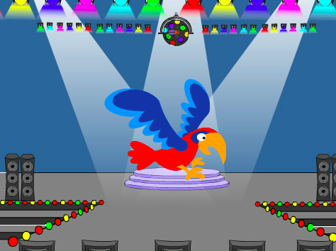
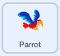
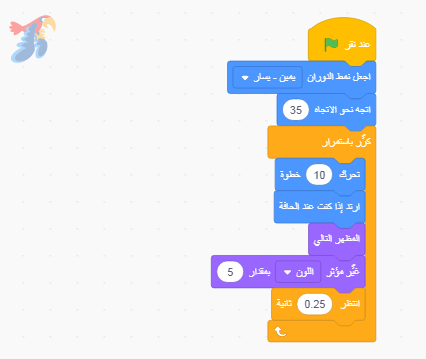

## الببغاء المزعج

<div style="display: flex; flex-wrap: wrap">
<div style="flex-basis: 200px; flex-grow: 1; margin-right: 15px;">
لتجعل من الصعب على اللاعبين العثور على الحشرة والنقر عليها، ستضيف ببغاءًا مزعجًا لإشغالهم. 
</div>
<div>

{:width="300px"}

</div>
</div>

### أضف كائن الببغاء

--- task ---

أضف كائن **الببغاء**.


--- /task ---

### حرك كائن الببغاء

في مشروع [اللحاق بالحافلة](https://projects.raspberrypi.org/en/projects/catch-the-bus){:target="_blank"}، كنت تستخدم حلقة `تكرار`{:class="block3control"}.

ستستخدم حلقة مختلفة هنا. تقوم حلقة `دائماً`{: class = "block3control"} بتشغيل وحدات التعليمات البرمجية بداخلها مرارًا وتكرارًا. إنها الحلقة المثالية لببغاء مزعج لن يتوقف عن الطيران ويعترض الطريق.

--- task ---

أضف التعليمات البرمجية لجعل الببغاء يرفرف بطريقة تشتت الانتباه: Look at the comments on the code blocks for some different numbers to try:




```blocks3
when flag clicked
set rotation style [left-right v] // do not go upside down
point in direction [35] // number from -180 to 180
forever // keep being annoying
move [10] steps // the number controls the speed
if on edge, bounce // stay on the Stage
next costume // flap
change [color v] effect by [5] // try 11 or 50
wait [0.25] seconds // try 0.1 or 0.5
end
```

--- /task ---

--- task ---

**اختبار:** انقر فوق العلم الأخضر واختبر مشروعك مرة أخرى. هل يمكنك أن تتذكر أين أخفيت الحشرة؟

في Scratch، تتوهج التعليمات البرمجية الجاري تشغيلها بمخطط أصفر:



**نصيحة:** إذا أصبح الببغاء مزعجًا للغاية أثناء قيامك بكتابة التعليمات البرمجية، فيمكنك النقر فوق زر التوقف الأحمر أعلى المنصة لإيقاف تشغيل البرنامج.

--- /task ---

