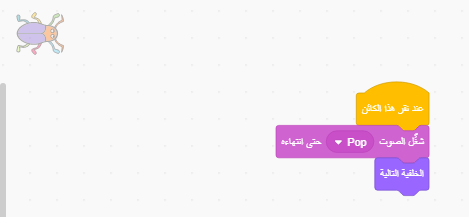

## المستوى الثاني

<div style="display: flex; flex-wrap: wrap">
<div style="flex-basis: 200px; flex-grow: 1; margin-right: 15px;">
اختر خلفية لإنشاء مستوى ثانٍ للعبتك، واجعل من الصعب العثور على الحشرة. 
</div>
<div>

{:width="300px"}

</div>
</div>

### أضف خلفية أخرى

--- task ---

**اختر:** اختر خلفية للمستوى الثاني. لقد اخترنا **المدينة**، ولكن يمكنك اختيار الصورة التي تحبها أكثر من غيرها.


**نصيحة:** تذكر أن الخلفيات التي تحتوي على الكثير من الألوان والتفاصيل ستجعل من الصعب العثور على الحشرة. إلى أي مدى ستجعل لعبتك صعبة؟

--- /task ---

### أوقف تشغيل الكود

--- task ---

اسحب الوحدات بعيدًا عن `عند النقر على الكائن`{:class="block3events"} لمنعها من العمل عند النقر فوق الحشرة:


--- /task ---

### غير حجم كائن الحشرة

--- task ---

أضف الكود `اضبط الحجم`{:class="block3looks"} للحشرة من أجل المستوى الثاني:


```blocks3
when backdrop switches to [Urban v] // choose your backdrop
set size to [20] % // try another size 
```

**اختبار:** انقر فوق البرنامَج الجديد لتشغيله.

--- /task ---

### إخفاء كائن الحشرة الخاص بك

--- task ---

اسحب الحشرة الخاصة بك على المنصة إلى مكان اختباء جيد لهذا المستوى.


--- /task ---

ضع الحشرة في مخبأها.

--- task ---

أضف وحدة لتحديد الإحداثيات `اذهب إلى س:ع:`{:class="block3motion"} إلى برنامجك:


```blocks3
when backdrop switches to [Urban v]
set size to [20] % // try another size 
+ go to x: [24] y: [13] // in the shop window
```

--- /task ---

### افحص تعليماتك البرمجية

--- task ---

انضم إلى الوحدات مرة أخرى إلى الرَّقْم `عند النقر على الكائن`{:class="block3events"} بحيث عند النقر على الحشرة، تتحول الخلفية إلى الخلفية `الخلفية التالية`{:class="block3looks"}:



--- /task ---

--- task ---

**اختبار:** انقر فوق العلم الأخضر لاختبار مشروعك.

--- /task ---

قد تكون الحشرة الآن أمام الببغاء.

--- task ---

أضف نصًا برمجيًا للتأكد من أن الحشرة دائما في `الخلف`{:class="block3looks"}:


```blocks3
when flag clicked
forever
go to [back v] layer
```

الآن، ستبقى الحشرة دائمًا في الخلف، حتى إذا كنت بحاجة إلى تغيير موضعها.

--- /task ---
