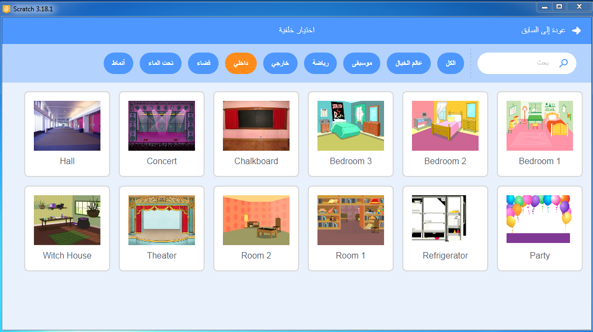
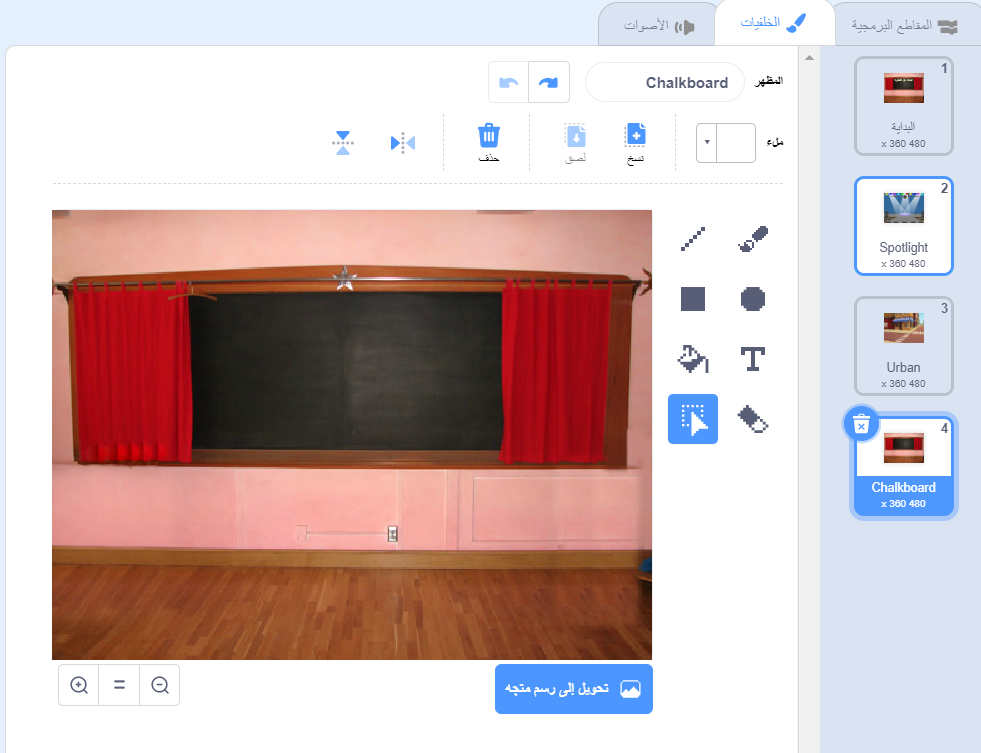

## شاشة النهاية

<div style="display: flex; flex-wrap: wrap">
<div style="flex-basis: 200px; flex-grow: 1; margin-right: 15px;">
ستنشئ شاشة "نهاية" لإظهار عدد الثواني التي استغرقها اللاعب للعثور على الحشرات. 
</div>
<div>

{:width="300px"}

</div>
</div>

<p style="border-left: solid; border-width:10px; border-color: #0faeb0; background-color: aliceblue; padding: 10px;">
في بعض الأحيان، لا يكفي مجرد الفوز في لعبة. يحب اللاعبون معرفة ما فعلوه ضد لاعبين آخرين أو ضد أنفسهم. هل يمكنك التفكير في لعبة تظهر لك مدى جودة أدائك؟</p>

### أضف خلفية أخرى

--- task ---

أضف خلفية **السبورة** من القسم **الداخلي**.



**نصيحة:** في Scratch، يمكنك إضافة نفس الخلفية أكثر من مرة.

--- /task ---

### التعديل على الصور الخلفية

--- task ---

انقر فوق علامة تبويب **الخلفيات** لفتح محرر الرسام.



--- /task ---

--- task ---

قم بتغيير اسم الخلفية إلى `نهاية`:


**نصيحة:** يمكنك إعادة تسمية الخلفية إلى **نهاية** لتسهيل فهم البرنامج الخاص بك.

--- /task ---

### ضع كائن الحشرة

--- task ---

انقر على كائن **الحشرة** وأضف تعليمات برمجية لوضع الحشرة على شاشة "النهاية":


```blocks3
when backdrop switches to [end v]
set size to [100] % // بالحجم الكامل
go to x: [0] y: [30] // على اللوحة
```

--- /task ---

### إضافة مؤقت

كم من الوقت يستغرق البحث عن الحشرات والنقر عليها؟ يحتوي Scratch على `مؤقت`{:class="block3sensing"} يمكنك استخدامه لحساب الوقت.

--- task ---

وحدة `المؤقت`{:class="block3sensing"} تكون موجودة في قائمة وحدات`الاستشعار`. أضف برنامجاً لجعل الحشرة`تقول`{:class="block3looks"}` 
المؤقت`{:class="block3sensing"} على شاشة "النهاية":


```blocks3
when backdrop switches to [end v]
set size to [100] % // بالحجم الكامل
go to x: [0] y: [30] // على اللوحة
+say (timer) // استغرقت ثوانٍ
```


--- /task ---

--- task ---

**اختبار:** انقر فوق العلم الأخضر لاختبار مشروعك. كم من الوقت يستغرق العثور عن الحشرات؟

--- /task ---

للرجوع إلى شاشة "البداية" ، انقر فوق الحشرة الموجودة في شاشة "النهاية".

--- task ---

أضف تعليمات برمجية لجعل الحشرة تتوقف عن قول `مؤقت`{:class="block3sensing"} عندما تذهب إلى شاشة "البداية":


```blocks3
when backdrop switches to [start v]
set size to [100] % // بالحجم الكامل
go to x: [0] y: [30] // على اللوحة
+say [] // لا تقل شيء
```

--- /task ---

### أوقف الموقت

إذا لعبت اللعبة مرة ثانية، فإنّ `المؤقت` سيستمر بالعدّ.

--- task ---

أضف تعليمات برمجية إلى `إعادة تعيين المؤقت`{:class="block3sensing"} عندما `تتغير الخلفية إلى`{:class="block3events"} المستوى الأول:


```blocks3
when backdrop switches to [Spotlight v] // المستوى الأول
set size to [20] % // صغير الحجم
go to x: [13] y: [132] // على كرة الديسكو
+reset timer // ابدأ الموقت
```

--- /task ---

--- task ---

**اختبار:** انقر على العلم الأخضر والعب اللعبة. يجب إعادة ضبط المؤقت عند النقر فوق الحشرة في شاشة "البدء" للانتقال إلى المستوى الأول. عند النقر على حشرة على الشاشة "نهاية"، يجب العودة إلى شاشة "ابدأ" ونرى أن الحشرة لا تقول ل `الموقت`{:فئة="block3sensing"}.

--- /task ---

