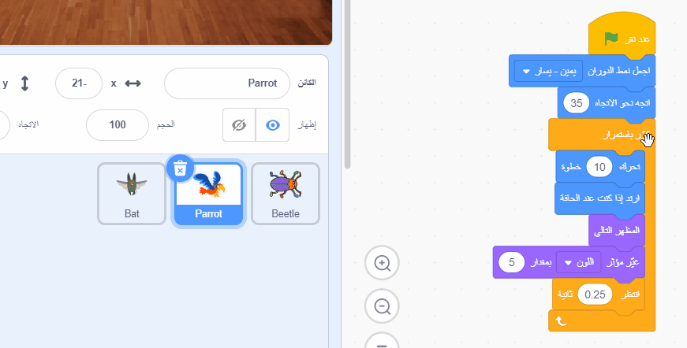

## قم بتطوير لعبتك

إذا كان لديك الوقت، يمكنك إضافة المزيد من المستويات والمزيد من عوامل التشتيت إلى لعبتك. يمكنك أيضًا تغيير الكائن المخفي وتغيير النص الموجود على السبورة.

إليك الكتل التي ستحتاجها لإخفاء الحشرة على مستوى جديد:

```blocks3
when backdrop switches to [new level v]

set size to [20] %

go to x: [0] y: [0] // drag to position the bug first

set [color v] effect to [50]
```

--- task ---

لكل مستوى، سوف تحتاج إلى:
- إضافة خلفية
- انقر على جزء المنصة، ثم على **الخلفيات**، ثم اسحب الخلفية الجديدة إلى موضعها قبل خلفية **النهاية**
- أضف وحدة `عندما تتغير الخلفية إلى`{: class = "block3events"} للخلفية الجديدة وأضف التعليمات البرمجية للموضع وإخفاء الحشرة

**نصيحة:** لسحب الحشرة إلى موضع اختباء جديد، ستحتاج إلى 'break' للبرنامج بحيث لا يتم تبديل الخلفية عند النقر فوق الحشرة لوضعها في مستوى جديد.

--- /task ---

--- task ---

يمكنك إضافة المزيد من الببغاوات أو اختيار كائن آخر ليكون بمثابة مصدر تشتيت.

هذا هو البرنامج الذي استخدمته للببغاء:
```blocks3
when flag clicked
set rotation style [left-right v] // do not go upside down
point in direction [35] // number from -180 to 180
forever // keep being annoying
move [10] steps // the number controls the speed
if on edge, bounce // stay on the Stage
next costume // flap
change [color v] effect by [5] // try 11 or 50
wait [0.25] seconds // try 0.1 or 0.5
end
```

**نصيحة:** يمكنك سحب رمز **Parrot** إلى كائن آخر لجعله أسرع لإنشاء كائن تشتيت آخر.



--- /task ---

--- collapse ---
---
المشروع المكتمل
---

يمكنك الحصول على [المشروع كاملاً من هنا](https://scratch.mit.edu/projects/486719939/){:target="_blank"}.

--- /collapse ---

--- save ---

