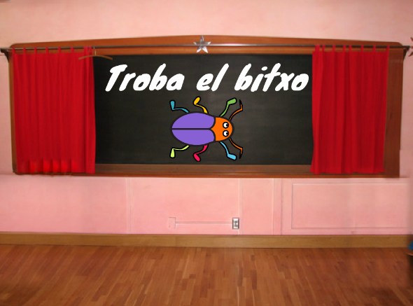
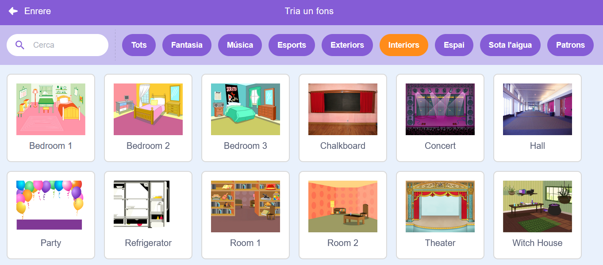
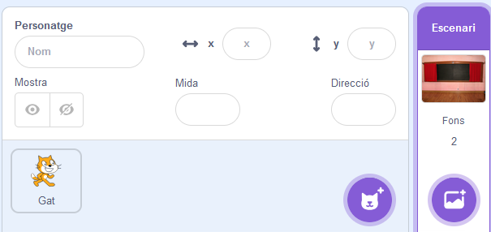
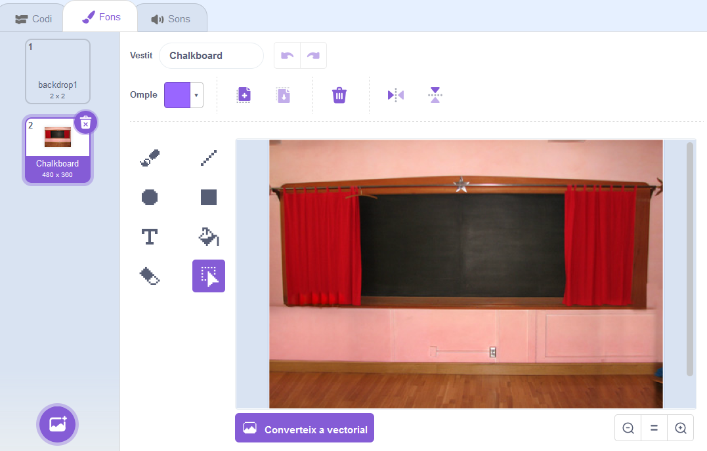
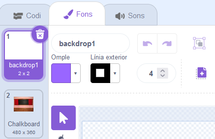
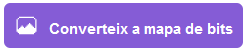
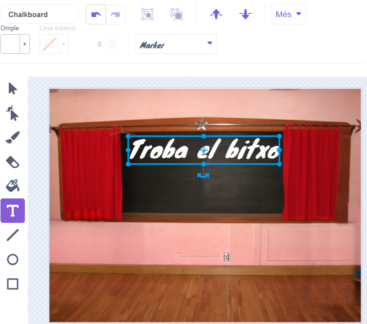
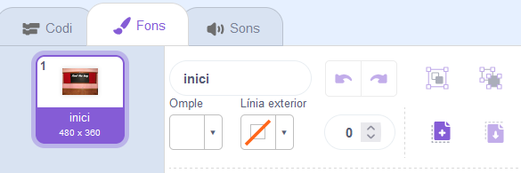
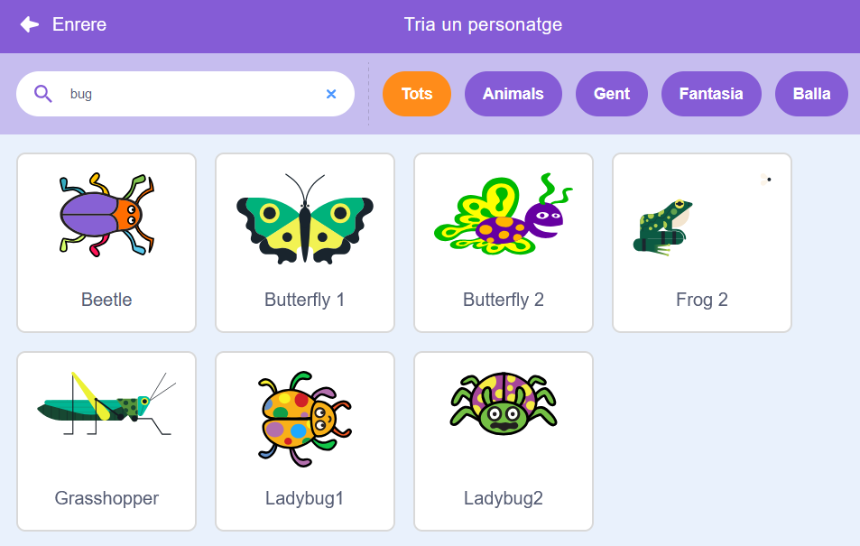

## Pantalla d'inici

Dóna al teu joc una pantalla d'inici.

{:width="300px"}

### Obre el projecte inicial

--- task ---

Obriu el [el projecte inicial  de Trobar l'error](https://scratch.mit.edu/projects/582214723/editor){:target="_blank"}. Scratch s'obrirà en una altra pestanya del navegador.

[[[working-offline]]]

--- /task ---

### Afegeix un fons

--- task ---

Afegeix el fons **Chalkboard** des de  la categoria **Interiors** .

--- /task ---

L' **Escenari** té una pestanya **Fons** en comptes d'una pestanya **Vestits** . Aquí és on podeu crear imatges per a l'**Escenari**.

--- task ---

Feu clic al panell de l'escenari.

--- /task ---

### Editeu el teló de fons

--- task ---

Feu clic a la pestanya <0>Fons</0> per obrir l'editor gràfic.

--- /task ---

--- task ---

Seleccioneu **backdrop1** i feu clic a la icona **Elimina** per eliminar el **backdrop1** del vostre projecte. No necessitareu el fons **backdrop** en aquest projecte.

--- /task ---

Ara es ressaltarà el fons **Chalkboard** .

--- task ---

Feu clic a **Converteix a mapa de bits**. Ara, podreu afegir text que podeu moure.

--- /task ---

--- task ---

Utilitzeu l'eina **Text** per afegir el text `Trobeu l'error` a la pissarra:

Hem utilitzat el **Marcador** en blanc, però **trieu** el tipus de la lletra i el color que voleu utilitzar.

**Consell:** Canvieu a l'eina **Selecciona** (Fletxa) per moure el text. Per canviar la mida del text, agafeu la cantonada del text i arrossegueu-lo.

--- /task ---

## Canvia el nom del teló de fons

--- task ---

Canvieu el nom del fons a `inici`perquè l'haureu de seleccionar més endavant al projecte.

**Consell:** Si utilitzeu noms que tinguin sentit, serà més fàcil entendre el vostre projecte, sobretot quan torneu a un projecte més tard.

--- /task ---

### Afegiu el personatge del Bug

--- task ---

Suprimeix el personatge **Gat Scratch** .

--- /task ---

--- task ---

Feu clic a **Tria un personatge** i escriviu `bug` al quadre de cerca.

**Tria:** Tria un bitxo que els jugadors hauran de trobar al teu joc.

**Consell:** Doneu un nom al vostre projecte. Potser us agradaria incloure el nom de l'error que acabeu de triar.

--- /task ---

Un error en un programa informàtic s'anomena **bug**. Cercar i eliminar errors en programes informàtics s'anomena **depuració**. Grace Hopper és una famosa enginyera de programari. El seu equip va trobar una vegada una arna al seu ordinador. Les seves notes diuen: "Primer cas real de bitxo que s'ha trobat".

