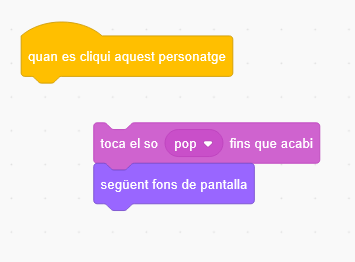

## Primer nivell

<div style="display: flex; flex-wrap: wrap">
<div style="flex-basis: 200px; flex-grow: 1; margin-right: 15px;">
Afegiu un nou teló de fons com a primer nivell del vostre joc i amagueu el bitxo.
</div>
<div>

{:width="300px"}

</div>
</div>

### Afegeix un altre teló de fons

--- task ---

Afegeix el fons **Spotlight** de la categoria **Música** .


--- /task ---

### Canvia la mida del bitxo

--- task ---

Feu clic al personatge **Bug** a la llista de Personatges. Afegiu una llista d'accions per canviar la `mida`{:class="block3looks"} del vostre error `quan el teló de fons canviï a Spotlight`{:class="block3events "}:


```blocks3
when backdrop switches to [Spotlight v]
set size to [20] % // tiny
```

--- /task ---

--- task ---

Feu clic al codi per canviar la mida i arrossegueu el vostre petit bitxo a un amagatall.

Afegiu codi per posicionar el vostre bitxo:


```blocks3
when backdrop switches to [Spotlight v]
set size to [20] % // tiny
+ go to x: [13] y: [132] // on the disco ball
```

**Trieu:** Podeu triar una mida i una ubicació diferents, si ho preferiu.

--- /task ---

### Passeu al següent teló de fons

Quan jugueu al joc i trobeu el bitxo correctament, el joc canviarà al següent teló de fons. A més, per iniciar el joc, feu clic al bitxo a la pantalla d'inici.

El bloc `següent teló de fons`{:class="block3looks"} canvia al següent teló de fons en l'ordre de la llista de fons a la pestanya **Fons** per a l'**escenari**.

--- task ---

Afegiu un script al vostre personatge **Bug** per a `reproduir un so pop`{:class="block3sound"} i canvieu al `següent teló de fons`{:class="block3looks"} `quan es fa clic en aquest personatge`{:class="block3events"}:


```blocks3
when this sprite clicked
play sound [Pop v] until done
next backdrop
```

--- /task ---

### Feu que el joc comenci amb la pantalla d'inici

--- task ---

Feu clic al panell de l'Escenari i afegiu aquest codi a l'**Escenari**:


```blocks3
when flag clicked
switch backdrop to [start v] // 'start' screen
```

--- /task ---

--- task ---

**Prova:** Fes clic a la bandera verda i prova el teu projecte.

Notareu que a la pantalla d'inici, el bitxo encara tindrà la configuració per amagar-se al seu amagatall des del primer nivell (en aquest exemple, a la bola de discoteca).

**Consell:** Després de l'últim teló de fons de la llista, `següent teló de fons`{:class="block3looks"} tornarà al primer teló de fons.

--- /task ---

--- task ---

Feu clic al personatge **Bug** a la llista de Personatges. Afegiu una llista d'accions per a `establir la mida`{:class="block3looks"} del bitxo quan el vostre fons de `canviï a`{:class="block3events" } la pantalla d'`inici `{:class="block3events"}:


```blocks3
when backdrop switches to [start v]
set size to [100] % // full-sized
```

--- /task ---

### Canvia la posició del bitxo

--- task ---

Intenteu situar el bitxo a la pantalla d'inici.

El vostre codi canviarà el fons quan feu clic al bitxo! Això no és útil quan intenteu posicionar el bitxo.

Per solucionar el problema, heu d'aturar l'execució del codi quan feu clic al bitxo.

--- /task ---

--- task ---

Feu clic a la bandera verda per tornar a la pantalla d'inici.

Feu clic al personatge del **Bug** a la llista de personatges i arrossegueu els blocs lluny del bloc `quan feu clic a aquest personatge`{:class="block3events"}:



--- /task ---

--- task ---

Intenteu a col·locar el bitxo de nou. Arrossegueu el bitxo a la pissarra, sota el text:


Afegiu codi per assegurar-vos que bitxo es col·loca a la pissarra cada vegada que canviï el`següent fons de pantalla`{:class="block3events"} a la pantalla d'`inici`{:class="block3events"}:


```blocks3
when backdrop switches to [start v]
set size to [100] % // full-sized
+ go to x: [0] y: [30] // on the board
```

--- /task ---

--- task ---

Torna a unir els blocs de manera que els blocs de codi estiguin sota el bloc `quan es cliqui aquest personatge`{:class="block3events"}:


--- /task ---

--- task ---

**Prova:** Fes clic a la bandera verda per iniciar el vostre projecte. Feu clic al bitxo per passar al següent teló de fons. El bitxo hauria de fer-se gran a la pantalla "inici" i petit al nivell "Spotlight".

--- collapse ---
---
title: No passa res quan faig clic al bitxo
---

T'has oblidat de tornar a unir el codi al bloc `quan es cliqui aquest personatge`{:class="block3events"}?

--- /collapse ---

--- /task ---