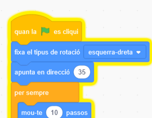

## Distracció del lloro

<div style="display: flex; flex-wrap: wrap">
<div style="flex-basis: 200px; flex-grow: 1; margin-right: 15px;">
Perquè sigui més difícil que els jugadors trobin i facin clic a bitxo, afegireu un lloro molest per distreure'ls. 
</div>
<div>

{:width="300px"}

</div>
</div>

### Afegiu el personatge del  Lloro

--- task ---

Afegeix el personatge **Parrot** .


--- /task ---

### Anima el personatge del Lloro

Al projecte [Agafa el autobús](https://projects.raspberrypi.org/ca-ES/projects/catch-the-bus){:target="_blank"}, heu utilitzat un bucle `repeteix`{:class="block3control"}.

Aquí fareu servir un bucle diferent. Un bucle `per sempre`{:class="block3control"} executa els blocs de codi que hi ha dins una vegada i una altra. És el bucle perfecte per a un lloro molest que no deixarà de volar i d'interposar-se.

--- task ---

Afegiu el codi per fer que el lloro es mogui d'una manera que distregui. Mireu els comentaris sobre els blocs de codi per veure alguns números diferents per provar:


```blocks3
when flag clicked
set rotation style [left-right v] // do not go upside down
point in direction [35] // number from -180 to 180
forever // keep being annoying
move [10] steps // the number controls the speed
if on edge, bounce // stay on the Stage
next costume // flap
change [color v] effect by [5] // try 11 or 50
wait [0.25] seconds // try 0.1 or 0.5
end
```

--- /task ---

--- task ---

**Prova:** Feu clic a la bandera verda i torneu a provar el vostre projecte. Recordes on vas amagar el bitxo?

A Scratch, el codi que s'està executant brilla amb un contorn groc:



**Consell:** Si el lloro es posa massa molest mentre esteu codificant, podeu fer clic al botó d'aturada vermell que hi ha a sobre de l'escenari per evitar que el codi s'executi.

--- /task ---

