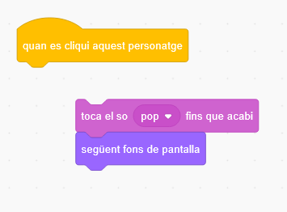
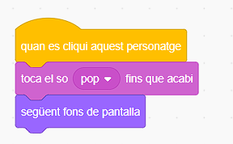

## Segon nivell

<div style="display: flex; flex-wrap: wrap">
<div style="flex-basis: 200px; flex-grow: 1; margin-right: 15px;">
Trieu un teló de fons per crear un segon nivell per al vostre joc i fer que el bitxo sigui difícil de trobar. 
</div>
<div>

{:width="300px"}

</div>
</div>

### Afegeix un fons

--- task ---

**Tria:** Tria un teló de fons per al teu segon nivell. Hem escollit el fons **Urban** , però pots triar el que més t'agradi.


**Consell:** Recordeu que els fons amb molts colors i detalls faran que el bitxo sigui més difícil de trobar. Què tan difícil faràs el teu joc?

--- /task ---

### Atureu l'execució del codi

--- task ---

Arrossegueu els blocs lluny del bloc `quan es cliqui aquest personatge`{:class="block3events"} per evitar que s'executin quan feu clic al bitxo:



--- /task ---

### Canvia la mida del bitxo

--- task ---

Afegiu el codi a `establiu la mida`{:class="block3looks"} del bitxo per al segon nivell:


```blocks3
when backdrop switches to [Urban v] // choose your backdrop
set size to [20] % // try another size 
```

**Prova:** Feu clic al vostre codi per executar-lo.

--- /task ---

### Amaga el teu bitxo

--- task ---

Arrossegueu el vostre bitxo a l'escenari fins a un bon amagatall per a aquest nivell.


--- /task ---

Col·loca el teu bitxo al seu amagatall.

--- task ---

Afegiu un bloc `aneu a x: y:`{:class="block3motion"} al vostre codi:


```blocks3
when backdrop switches to [Urban v]
set size to [20] % // try another size 
+ go to x: [24] y: [13] // in the shop window
```

--- /task ---

### Prova el teu codi

--- task ---

Uneix el bloc de darrere al bloc `quan es cliqui aquest personatge`{:class="block3events"}  llavors quan es faci clic al bitxo el fons canvia al`següent fons de pantalla`{:class="block3looks"}:



--- /task ---

--- task ---

**Prova:** Feu clic a la bandera verda per provar el vostre projecte.

--- /task ---

El vostre bitxo pot estar ara davant del lloro.

--- task ---

Afegiu unes accions de codi per assegurar-vos que el vostre bitxo estigui sempre al `darrere`{:class="block3looks"}:


```blocks3
when flag clicked
forever
go to [back v] layer
```

Ara, el vostre bitxo sempre es quedarà al darrere, fins i tot si necessiteu canviar-ne la posició.

--- /task ---
