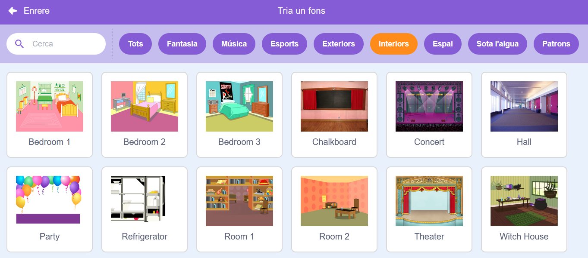

## Pantalla final

<div style="display: flex; flex-wrap: wrap">
<div style="flex-basis: 200px; flex-grow: 1; margin-right: 15px;">
Creeu una pantalla "final" per mostrar el nombre de segons que ha trigat el jugador a trobar els bitxos. 
</div>
<div>

{:width="300px"}

</div>
</div>

<p style="border-left: solid; border-width:10px; border-color: #0faeb0; background-color: aliceblue; padding: 10px;">
De vegades, només guanyar un joc no és suficient. Als jugadors els agrada saber com ho han fet contra altres jugadors o contra ells mateixos. Pots pensar en un joc que et mostri el bé que ho has fet?</p>

### Afegeix un altre teló de fons

--- task ---

Afegeix el fons **Chalkboard** des de  la categoria **Interiors** .



**Consell:** A Scratch, podeu afegir el mateix teló de fons més d'una vegada.

--- /task ---

### Editeu el teló de fons

--- task ---

Feu clic a la pestanya **Fons** per obrir l'editor gràfic.


--- /task ---

--- task ---

Canvieu el nom del fons a `fi`:


**Consell:** Canvieu el nom del fons a **fi** per facilitar la comprensió del vostre codi.

--- /task ---

### Col·loca el bitxo

--- task ---

Feu clic al personatge **Bug** i afegiu codi per situar el bitxo a la pantalla "final":


```blocks3
when backdrop switches to [end v]
set size to [100] % // full-sized
go to x: [0] y: [30] // on the board
```

--- /task ---

### Afegiu un cronòmetre

Quant de temps trigues a trobar i fer clic als bitxos? Scratch té un cronòmetre``{:class="block3sensing"} que podeu utilitzar per esbrinar-ho.

--- task ---

El bloc del `cronòmetre`{:class="block3sensing"} prové del menú de blocs `Sensors`{:class="block3sensing"}. Afegiu codi per fer que el bitxo`digues`{:class="block3looks"} el cronòmetre ``{:class="block3sensing"} al 'final' pantalla:


```blocks3
when backdrop switches to [end v]
set size to [100] % // full-sized
go to x: [0] y: [30] // on the board
+say (timer) // seconds taken
```


--- /task ---

--- task ---

**Prova:** Feu clic a la bandera per provar les teves habilitats. Quant de temps trigues a trobar el bitxo?

--- /task ---

Per tornar a la pantalla "inici", feu clic a l'error a la pantalla "fi".

--- task ---

Afegiu codi per fer que bitxor deixi de dir el  `cronòmetre`{:class="block3sensing"} quan aneu a la pantalla "inici":


```blocks3
when backdrop switches to [start v]
set size to [100] % // full-sized
go to x: [0] y: [30] // on the board
+say [] // say nothing
```

--- /task ---

### Atura el cronòmetre

Si jugueu el joc per segona vegada, el  `cronòmetre`{:class="block3sensing"} continuarà comptant.

--- task ---

Afegeix el codi per a `reinicia el temporitzador`{:class="block3sensing"} quan el canviï al  `següent fons de pantalla`{:class="block3events"} al del  primer nivell :


```blocks3
when backdrop switches to [Spotlight v] // first level
set size to [20] % // tiny
go to x: [13] y: [132] // on the disco ball
+reset timer // start the timer
```

--- /task ---

--- task ---

**Prova:** Feu clic a la bandera verda i juegueu al joc. El cronòmetre s'ha de restablir quan feu clic a bitxo a la pantalla d'inici per passar al primer nivell. Quan feu clic a bitxo a la pantalla "fi", hauríeu de tornar a la pantalla "inici" i veure que el bitxo no diu el  `cronòmetre`{:class="block3sensing"} .

--- /task ---

