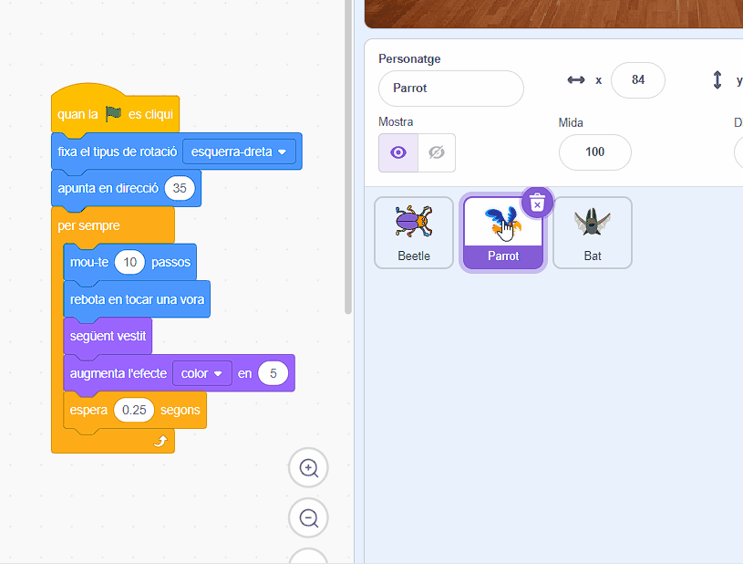

## Actualitza el teu joc

Si teniu temps, podeu afegir més nivells i més distraccions al vostre joc. També podeu canviar el personatge que s'amaga i canviar el text a la pissarra.

--- task ---

Juga al teu joc i mira amb quina rapidesa pots trobar els bitxos.

Hi ha algú més que pugui provar el teu joc? Amb quina rapidesa poden trobar els bitxos? No sabran on els has amagat, així que pot ser que triguin una mica més!

Hi ha alguna cosa que vulguis canviar?

Podríeu:
- Feu que el lloro sigui encara més molest
- Feu que els insectes siguin més petits
- Canvia l' `efecte de color`{:class="block3looks"} per camuflar el bitxo a cada nivell
- Canvia el tipus de lletra o el color del text

--- /task ---

### Afegeix més nivells

--- task ---

Aquests són els blocs que necessitareu per amagar el bitxo en un nou nivell:

```blocks3
when backdrop switches to [new level v]

set size to [20] %

go to x: [0] y: [0] // drag to position the bug first

set [color v] effect to [50]
```

Per a cada nivell, haureu de:
- Afegir un fons
- Feu clic al panell de l'escenari, després a la pestanya **Fons** i arrossegueu el nou teló de fons a la posició abans del **fi** .
- Afegiu un bloc **següent fons de pantalla**{:class="block3events"} per al nou fons i afegiu codi a la posició, i amagueu el bitxo

**Consell:** Per arrossegar el bitxo a una nova posició oculta, haureu d'aturar el codi perquè el fons no canviï quan feu clic a bitxo, per deixar-ho a una nova posició al nou nivell.

--- /task ---

### Afegiu més distraccions

--- task ---

Podeu afegir més lloros o triar un altre personatges per actuar com a distracció.

Aquí teniu el codi que heu utilitzat per al lloro:

```blocks3
when flag clicked
set rotation style [left-right v] // do not go upside down
point in direction [35] // number from -180 to 180
forever // keep being annoying
move [10] steps // the number controls the speed
if on edge, bounce // stay on the Stage
next costume // flap
change [color v] effect by [5] // try 11 or 50
wait [0.25] seconds // try 0.1 or 0.5
end
```

<0>Consell:</0> Podeu arrossegar el codi del personatge <0>Parrot</0> a un altre personatge perquè sigui més ràpid crear una altra distracció.



--- /task ---

--- collapse ---
---
títol: Projecte finalitzat
---

Pots veure el [projecte completat  aquí](https://scratch.mit.edu/projects/486719939/){:target="_blank"}.

--- /collapse ---