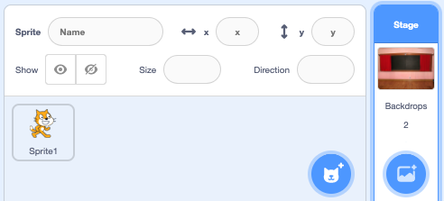
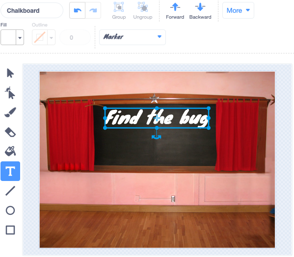

## Startovací obrazovka

Dej své hře "startovací" obrazovku.

{:width="300px"}

### Otevři úvodní projekt

--- task ---

Otevři [startovací projekt Najdi brouka](https://scratch.mit.edu/projects/582214723/editor){:target="_blank"}. Scratch se otevře na jiné kartě prohlížeče.

[[[working-offline]]]

--- /task ---

### Přidej kulisu

--- task ---

Přidej pozadí **Tabule** z kategorie **Vnitřní prostory**.

--- /task ---

**Scéna** má záložku **Pozadí** namísto záložky **Kostýmy**. Zde můžeš vytvářet obrázky pro **Scénu**.

--- task ---

Klikni na podokno Scéna.

--- /task ---

### Uprav Pozadí

--- task ---

Kliknutím na kartu **Pozadí** otevři editor Malování.

--- /task ---

--- task ---

Vyber **pozadí1** a klikni na ikonu **Smazat** pro odstranění pozadí **pozadí1** z tvého projektu. V tomto projektu nebudete potřebovat pozadí **pozadí1**.

--- /task ---

Pozadí **Tabule** se nyní zvýrazní.

--- task ---

Klikni na **Převést na vektor**. Nyní můžeš přidat text, kterým lze pohybovat.

--- /task ---

--- task ---

Pomocí nástroje **Text** přidej text `Najdi brouka` na tabuli:

Použili jsme písmo **Značka** v bílé barvě, ale **vyber si** písmo a barvu, kterou chceš použít ty.

**Tip:** Switch to the **Select** (Arrow) tool to move your text around. To change the size of the text, grab the corner of the text and drag it.

--- /task ---

## Rename the Backdrop

--- task ---

Change the name of the backdrop to `start`, because you will need to select it later in the project.

**Tip:** If you use names that make sense, it will be easier to understand your project, especially when you come back to a project later.

--- /task ---

### Add the Bug Sprite

--- task ---

Delete the **Scratch Cat** sprite.

--- /task ---

--- task ---

Click on **Choose a Sprite** and type `bug` in the search box.

**Choose:** Choose a bug, which players will need to find in your game.

**Tip:** Give your project a name. You might like to include the name of the bug that you have just chosen.

--- /task ---

A mistake in a computer program is called a **bug**. Finding and removing mistakes in computer programs is called **debugging**. Grace Hopper is a famous software engineer. Her team once found a moth in their computer. Their notes say, "First actual case of bug being found."

