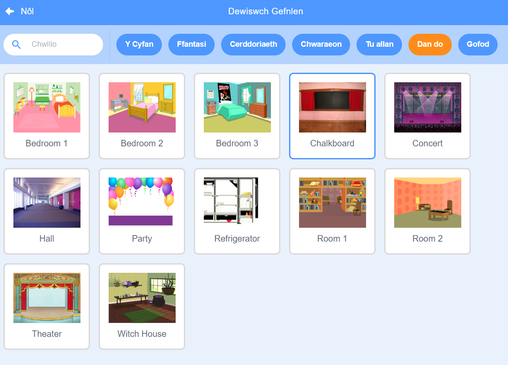

## Sgrin cychwyn

Bydd eich gêm yn dechrau gyda sgrin 'cychwyn', a bydd chwaraewyr yn clicio ar y chwilen i fynd i'r lefel gyntaf.

{:width="300px"}

--- task ---

Agora'r [prosiect cychwynnol canfod y chwilen](https://scratch.mit.edu/projects/582214723/editor){:target="_blank"}. Bydd Scratch yn agor mewn tab arall ar y porwr.

[[[working-offline]]]

--- /task ---

--- task ---

Ychwanega'r gefnlen **Chalkboard** o'r categori **Tu allan**.

--- /task ---

Mae gan y **Llwyfan** dab **Cefnlenni** yn hytrach na thab **Gwisgoedd**. Dyma lle galli di greu delweddau ar gyfer y **Llwyfan**.

--- task ---

Clicia ar y cwarel Llwyfan.

--- /task ---

--- task ---

Clicia ar y tab **Cefnlenni** i agor y Golygydd paent.

--- /task ---

--- task ---

Dewisa **backdrop1** a chlicio ar yr eicon **Dileu** i dynnu'r gefnlen **backdrop1** o dy brosiect. Fydd dim angen y gefnlen **backdrop1** yn y prosiect hwn.

--- /task ---

Bydd y gefnlen **Chalkboard** wedi'i hamlygu nawr.

--- task ---

Clicia ar **Trosi i Fector**. Nawr, byddi di'n gallu ychwanegu testun y galli di ei symud o gwmpas.

--- /task ---

--- task ---

Defnyddia'r offeryn **Testun** i ychwanegu'r testun `Chwilio am chwilen` at y bwrdd du:

Fe ddefnyddion ni'r ffont **Marker** mewn gwyn, ond **dewisa** y ffont a'r lliw rwyt ti am eu defnyddio.

**Awgrym:** Newidia i'r offeryn **Dewis** (Saeth) i symud dy destun o gwmpas. I newid maint y testun, cydia yng nghornel y testun a'i lusgo.

--- /task ---

--- task ---

Newidia enw'r gefnlen i `dechrau`, oherwydd bydd angen i ti ei dewis yn nes ymlaen yn y prosiect.

**Awgrym:** Os wyt ti'n defnyddio enwau sy'n gwneud synnwyr, bydd yn haws deall dy brosiect, yn enwedig pan ddoi di yn ôl i brosiect yn nes ymlaen.

--- /task ---

--- task ---

Dilea'r corlun **Scratch Cat**.

--- /task ---

--- task ---

Clicia ar **Dewiswch Gorlun** a theipio `bug` yn y blwch chwilio.

**Dewis:** Dewisa chwilen y bydd angen i chwaraewyr ddod o hyd iddo yn dy gêm.

**Awgrym:** Rho enw i dy brosiect. Efallai yr hoffet ti gynnwys enw'r chwilen rwyt ti newydd ei ddewis.

--- /task ---

Mae camgymeriad mewn rhaglen gyfrifiadurol yn cael ei alw'n **chwilen**. Yr enw am ddod o hyd i gamgymeriadau mewn rhaglenni cyfrifiadurol a'u tynnu yw **difa chwilod**. Mae Grace Hopper yn beiriannydd meddalwedd enwog. Daeth ei thîm o hyd i wyfyn yn eu cyfrifiadur ar un adeg. Dywed eu nodiadau, "Yr achos go iawn cyntaf o chwilen yn cael ei ddarganfod."

--- save ---

