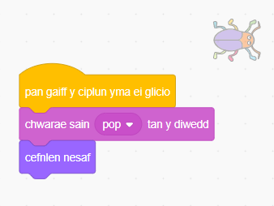

## Lefel gyntaf

<div style="display: flex; flex-wrap: wrap">
<div style="flex-basis: 200px; flex-grow: 1; margin-right: 15px;">
Byddi di'n ychwanegu cefndir newydd fel y lefel gyntaf yn dy gêm, ac yn cuddio'r chwilen.
</div>
<div>

{:width="300px"}

</div>
</div>

--- task ---

Ychwanega'r gefnlen **Spotlight** o'r categori **Cerddoriaeth**.


--- /task ---

--- task ---

Clicia ar y corlun **bug** yn rhestr y Corluniau. Ychwanega sgript i newid `maint`{:class="block3looks"} dy chwilen `pan fydd y gefnlen yn newid i Spotlight`{:class="block3events"}:


```blocks3
when backdrop switches to [Spotlight v]
set size to [20] % // tiny
```

--- /task ---

--- task ---

Clicia ar y cod i newid y maint, yna llusga dy chwilen fach i guddfan.

Ychwanega god i roi lleoliad dy chwilen:


```blocks3
when backdrop switches to [Spotlight v]
set size to [20] % // tiny
+ go to x: [13] y: [132] // on the disco ball
```

**Dewis:** Galli di ddewis maint a lleoliad gwahanol, os yw'n well gen ti.

--- /task ---

Pan fyddi di'n chwarae'r gêm ac yn llwyddo i ddod o hyd i'r chwilen, bydd y gêm yn newid i'r gefnlen nesaf. Hefyd, i ddechrau'r gêm, byddi di'n clicio ar y chwilen ar y sgrin 'dechrau'.

Mae'r bloc `cefnlen nesaf`{:class="block3looks"} yn newid i'r gefnlen nesaf yn y drefn y mae'r cefnlenni wedi'u rhestru pan fyddi di'n clicio'r tab **Cefnlenni** ar gyfer y **Llwyfan**.

--- task ---

Ychwanega sgript i dy gorlun **bug** i `chwarae sain Pop`{:class="block3sound"} a newid i'r `gefnlen nesaf`{:class="block3looks"} `pan gaiff y corlun hwn ei glicio`{:class="block3events"}:


```blocks3
when this sprite clicked
play sound [Pop v] until done
next backdrop
```

--- /task ---

Mae angen i dy brosiect ddechrau ar y sgrin 'dechrau'.

--- task ---

Clicia ar gwarel y Llwyfan ac ychwanegu'r cod yma at y **Llwyfan**:


```blocks3
when flag clicked
switch backdrop to [start v] // 'start' screen
```

--- /task ---

--- task ---

**Prawf:** Clicia ar y faner werdd i brofi dy brosiect.

Byddi di'n sylwi ar y sgrin ‘dechrau’ fod gan y chwilen dal y gosodiadau i guddio yn ei chuddfan o’r lefel gyntaf (yn yr enghraifft hon, ar y bêl ddisgo).

**Awgrym:** Ar ôl y gefnlen ddiwethaf yn y rhestr, bydd `cefnlen nesaf`{:class="block3looks"} yn newid yn ôl i'r gefnlen gyntaf.

--- /task ---

--- task ---

Clicia ar y corlun **bug** yn y rhestr Corluniau. Ychwanega sgript i `osod maint`{:class="block3looks"} y chwilen pan fydd dy `gefnlen yn newid i'r`{:class="block3events"} sgrin `cychwyn`{:class="block3events"}:


```blocks3
when backdrop switches to [start v]
set size to [100] % // full-sized
```

--- /task ---

--- task ---

Ceisia osod lleoliad y chwilen ar y sgrin 'cychwyn'.

Bydd dy god yn gwneud i'r gefnlen newid pan fyddi di'n clicio ar y chwilen! Dydy hynny ddim fawr o help pan wyt ti'n chi'n ceisio gosod lleoliad y chwilen.

--- /task ---

I ddatrys y broblem, rwyt ti angen rhwystro'r cod rhag rhedeg pan fyddi di'n clicio ar y chwilen.

--- task ---

Clicia ar y faner werdd i ddychwelyd i'r sgrin 'cychwyn'.

Clicia ar y corlun **bug** yn y rhestr Corluniau a llusgo'r blociau i ffwrdd o'r bloc `when gaiff y corlun hwn ei glicio`{:class="block3events"}:


--- /task ---

--- task ---

Rho gynnig arall ar osod lleoliad y chwilen. Llusga'r chwilen ar i'r bwrdd du, o dan y testun:


Ychwanega god i wneud yn siŵr bod y chwilen wedi'i lleoli ar y bwrdd du bob tro mae dy `gefnlen yn newid i'r`{:class="block3events"} sgrin `cwch`{:class="block3events"}:


```blocks3
when backdrop switches to [start v]
set size to [100] % // full-sized
+ go to x: [0] y: [30] // on the board
```

--- /task ---

--- task ---

Cysyllta'r blociau at ei gilydd eto fel bod y blociau cod o dan y bloc `pan gaiff y corlun hwn ei glicio`{:class="block3events"} eto:



--- /task ---

--- task ---

**Prawf:** Clicia ar y faner werdd i brofi dy brosiect. Clicia ar y chwilen i symud i'r gefnlen nesaf. Dylai'r chwilen fod yn fawr ar y sgrin 'dechrau' ac yn fach ar y lefel 'Spotlight'.

--- collapse ---
---
title: Does dim byd yn digwydd pan dw i'n clicio ar y chwilen
---

Wnes di anghofio cysylltu'r cod yn ôl i'r bloc `pan gaiff y corlun hwn ei glicio`{:class="block3events"}?

--- /collapse ---

--- /task ---

--- save ---
