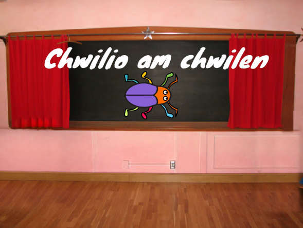

## Lefel gyntaf

<div style="display: flex; flex-wrap: wrap">
<div style="flex-basis: 200px; flex-grow: 1; margin-right: 15px;">
Byddi di'n ychwanegu cefndir newydd fel y lefel gyntaf yn dy gêm, ac yn cuddio'r chwilen.
</div>
<div>

{:width="300px"}

</div>
</div>

### Add another Backdrop

--- task ---

Ychwanega'r gefnlen **Spotlight** o'r categori **Cerddoriaeth**.


--- /task ---

### Resize the bug

--- task ---

Clicia ar y corlun **bug** yn rhestr y Corluniau. Ychwanega sgript i newid `maint`{:class="block3looks"} dy chwilen `pan fydd y gefnlen yn newid i Spotlight`{:class="block3events"}:


```blocks3
when backdrop switches to [Spotlight v]
set size to [20] % // tiny
```

--- /task ---

--- task ---

Clicia ar y cod i newid y maint, yna llusga dy chwilen fach i guddfan.

Ychwanega god i roi lleoliad dy chwilen:


```blocks3
when backdrop switches to [Spotlight v]
set size to [20] % // tiny
+ go to x: [13] y: [132] // on the disco ball
```

**Dewis:** Galli di ddewis maint a lleoliad gwahanol, os yw'n well gen ti.

--- /task ---

### Move to the next Backdrop

Pan fyddi di'n chwarae'r gêm ac yn llwyddo i ddod o hyd i'r chwilen, bydd y gêm yn newid i'r gefnlen nesaf. Hefyd, i ddechrau'r gêm, byddi di'n clicio ar y chwilen ar y sgrin 'dechrau'.

Mae'r bloc `cefnlen nesaf`{:class="block3looks"} yn newid i'r gefnlen nesaf yn y drefn y mae'r cefnlenni wedi'u rhestru pan fyddi di'n clicio'r tab **Cefnlenni** ar gyfer y **Llwyfan**.

--- task ---

Ychwanega sgript i dy gorlun **bug** i `chwarae sain Pop`{:class="block3sound"} a newid i'r `gefnlen nesaf`{:class="block3looks"} `pan gaiff y corlun hwn ei glicio`{:class="block3events"}:


```blocks3
when this sprite clicked
play sound [Pop v] until done
next backdrop
```

--- /task ---

### Make the game start with the Start Screen

--- task ---

Click on the Stage pane and add this code to the **Stage**:


```blocks3
when flag clicked
switch backdrop to [start v] // 'start' screen
```

--- /task ---

--- task ---

**Test:** Click on the green flag to test your project.

**Prawf:** Clicia ar y faner werdd i brofi dy brosiect.

Byddi di'n sylwi ar y sgrin ‘dechrau’ fod gan y chwilen dal y gosodiadau i guddio yn ei chuddfan o’r lefel gyntaf (yn yr enghraifft hon, ar y bêl ddisgo).

--- /task ---

--- task ---

Click on the **bug** sprite in the Sprite list. Add a script to `set the size`{:class="block3looks"} of the bug when your `backdrop switches to`{:class="block3events"} the `start`{:class="block3events"} screen:


```blocks3
when backdrop switches to [start v]
set size to [100] % // full-sized
```

--- /task ---

### Change the position of the bug

--- task ---

Try to position the bug on the 'start' screen.

Your code will make the backdrop switch when you click on the bug! That is not helpful when you are trying to position the bug.

Bydd dy god yn gwneud i'r gefnlen newid pan fyddi di'n clicio ar y chwilen! Dydy hynny ddim fawr o help pan wyt ti'n chi'n ceisio gosod lleoliad y chwilen.

--- /task ---

--- task ---

Click on the green flag to return to the 'start' screen.

Clicia ar y faner werdd i ddychwelyd i'r sgrin 'cychwyn'.


--- /task ---

--- task ---

Try to position the bug again. Drag the bug onto the chalkboard, below the text:



Add code to make sure that the bug is positioned on the chalkboard every time your `backdrop switches to`{:class="block3events"} the `start`{:class="block3events"} screen:


```blocks3
when backdrop switches to [start v]
set size to [100] % // full-sized
+ go to x: [0] y: [30] // on the board
```

--- /task ---

--- task ---

Join the blocks back together so that the code blocks are under the `when this sprite clicked`{:class="block3events"} block again:


--- /task ---

--- task ---

**Test:** Click on the green flag to test your project. Click on the bug to move to the next backdrop. The bug should be big on the 'start' screen and small on the 'Spotlight' level.

--- collapse ---
---
title: Does dim byd yn digwydd pan dw i'n clicio ar y chwilen
---

Did you forget to join the code back to the `when this sprite clicked`{:class="block3events"} block?

--- /collapse ---

--- /task ---