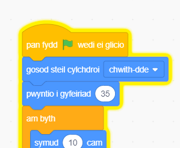

## Parot i dynnu sylw

<div style="display: flex; flex-wrap: wrap">
<div style="flex-basis: 200px; flex-grow: 1; margin-right: 15px;">
Er mwyn ei gwneud hi'n anoddach i chwaraewyr ddod o hyd i'r chwilen a chlicio arni, byddi di'n ychwanegu parot annifyr i dynnu eu sylw. 
</div>
<div>

{:width="300px"}

</div>
</div>

--- task ---

Ychwanega'r corlun **Parrot**.


--- /task ---

Yn y prosiect [Dal y bws](https://projects.raspberrypi.org/en/projects/catch-the-bus){:target="_blank"}, fe wnes di ddefnyddio dolen `ailadrodd`{:class="block3control"}.

Byddi di'n defnyddio dolen wahanol yma. Mae dolen `am byth`{:class="block3control"} yn rhedeg y blociau cod tu mewn iddi dro ar ôl tro. Dyma'r ddolen berffaith ar gyfer parot annifyr sy'n hedfan o gwmpas a mynd yn y ffordd drosodd a throsodd.

--- task ---

Ychwanega god i wneud i'r parot fflapio o gwmpas mewn ffordd sy'n tynnu sylw:


```blocks3
when flag clicked
set rotation style [left-right v] // do not go upside down
point in direction [35] // number from -180 to 180
forever // keep being annoying
move [10] steps // the number controls the speed
if on edge, bounce // stay on the Stage
next costume // flap
change [color v] effect by [5] // try 11 or 50
wait [0.25] seconds // try 0.1 or 0.5
end
```

--- /task ---

--- task ---

**Prawf:** Clicia ar y faner werdd a phrofi dy brosiect eto. Allet ti gofio lle wnes di guddio'r chwilen?

Yn Scratch, mae cod sy'n rhedeg yn tywynnu gydag amlinelliad melyn:



**Awgrym:** Os ydy'r parot yn mynd yn rhy annifyr wrth godio, gallwch glicio ar y botwm stop coch uwchben y Llwyfan i atal y cod rhag rhedeg.

--- /task ---

--- save ---
