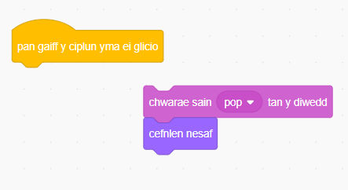
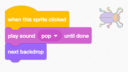

## Ail lefel

<div style="display: flex; flex-wrap: wrap">
<div style="flex-basis: 200px; flex-grow: 1; margin-right: 15px;">
Byddi di'n dewis cefndir i wneud ail lefel ar gyfer dy gêm, ac yn ei gwneud hi'n anodd dod o hyd i'r chwilen. 
</div>
<div>

{:width="300px"}

</div>
</div>

### Add another backdrop

--- task ---

**Dewis:** Dewisa gefnlen ar gyfer dy ail lefel. Rydyn ni wedi dewis y gefnlen **Urban**, ond gallet ti ddewis yr un rwyt ti'n ei hoffi fwyaf.


**Awgrym:** Cofia bydd cefndiroedd gyda llawer o liwiau a manylion yn ei gwneud hi'n anoddach dod o hyd i'r chwilen. Pa mor anodd wyt ti am wneud dy gêm?

--- /task ---

### Stop the code from running

--- task ---

Drag the blocks away from the `when this sprite clicked`{:class="block3events"} block to stop them from running when you click on the bug:



--- /task ---

### Resize the bug

--- task ---

Mae angen i dy chwilen fod yn anodd dod o hyd iddi pan fydd y gefnlen yn newid. Galli di newid maint y chwilen i'w gwneud hi'n anoddach dod o hyd iddi.


```blocks3
when backdrop switches to [Urban v] // choose your backdrop
set size to [20] % // try another size 
```

Ychwanega god i `osod maint`{:class="block3looks"} y chwilen ar gyfer yr ail lefel:

--- /task ---

### Hide your bug

--- task ---

Drag your bug on the Stage to a good hiding place for this level.


--- /task ---

Position your bug in its hiding place.

--- task ---

Rho dy chwilen yn ei chuddfan.


```blocks3
when backdrop switches to [Urban v]
set size to [20] % // try another size 
+ go to x: [24] y: [13] // in the shop window
```

--- /task ---

### Test your code

--- task ---

Join the blocks back to the `when this sprite clicked`{:class="block3events"} block so that when the bug is clicked, the backdrop switches to the `next backdrop`{:class="block3looks"}:



--- /task ---

--- task ---

**Test:** Click on the green flag to test your project.

--- /task ---

**Prawf:** Clicia ar y faner werdd i brofi dy brosiect.

--- task ---

Efallai fod dy chwilen nawr o flaen y parot.


```blocks3
when flag clicked
forever
go to [back v] layer
```

Ychwanega sgript i wneud yn siŵr fod dy chwilen bob amser yn y `cefn`{:class="block3looks"}:

--- /task ---
