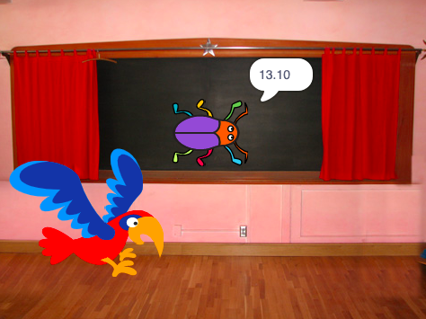
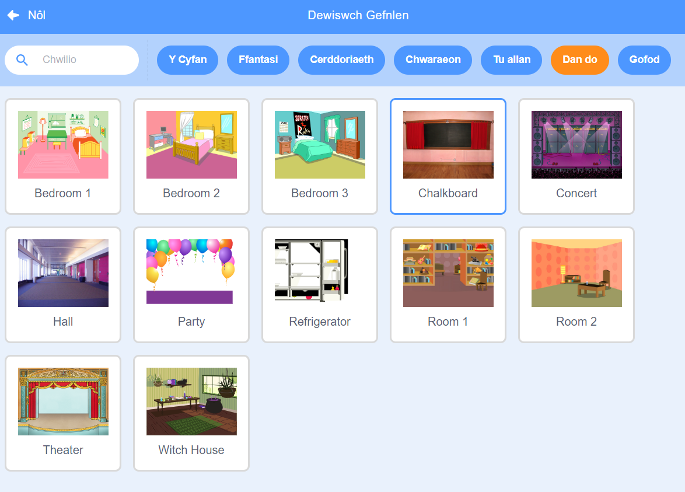
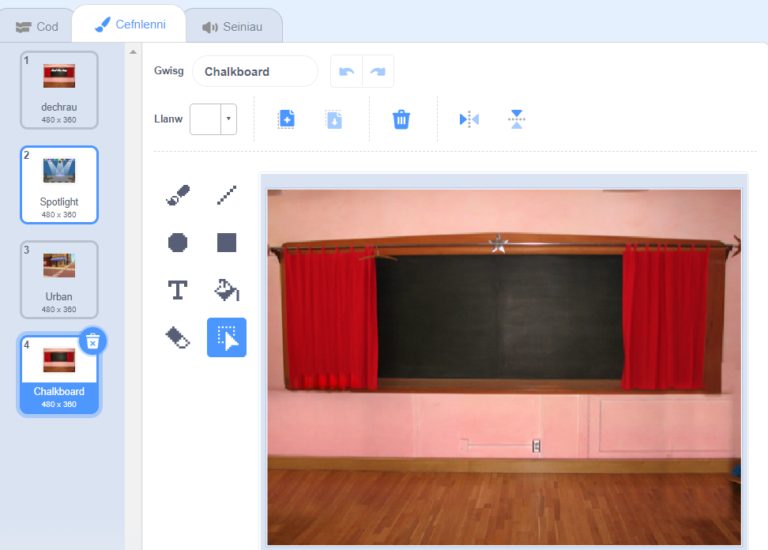
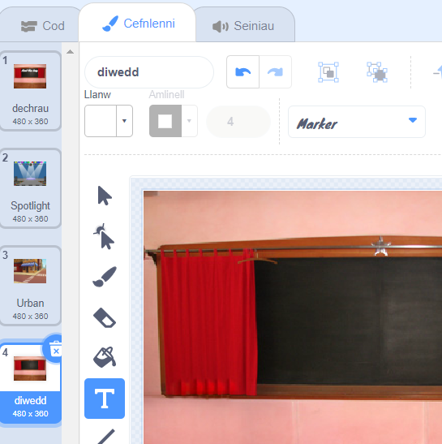
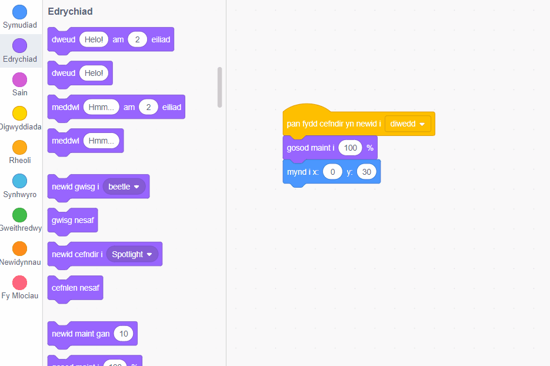

## Sgrin diwedd

<div style="display: flex; flex-wrap: wrap">
<div style="flex-basis: 200px; flex-grow: 1; margin-right: 15px;">
Byddi di'n creu sgrin 'diwedd' i ddangos faint o eiliadau mae wedi cymryd i'r chwaraewr ddod o hyd i'r chwilod. 
</div>
<div>

{:width="300px"}

</div>
</div>

<p style="border-left: solid; border-width:10px; border-color: #0faeb0; background-color: aliceblue; padding: 10px;">
Weithiau, dydy curo gêm ddim yn ddigon. Mae chwaraewyr yn hoffi gwybod sut wnaethon nhw yn erbyn chwaraewyr eraill neu eu hunain. Alli di feddwl am gêm sy'n dangos pa mor dda wnes di chwarae?</p>

--- task ---

Ychwanega'r gefnlen **Chalkboard** o'r categori **Dan Do**.



**Awgrym:** Yn Scratch, galli di ychwanegu'r un gefnlen fwy nag unwaith.

--- /task ---

--- task ---

Clicia ar y tab **Cefnlenni** i agor y Golygydd paent.



--- /task ---

--- task ---

Newidia enw'r gefnlen i `diwedd`:



**Awgrym:** Rwyt ti'n ailenwi'r gefnlen i **ddiwedd** i'w gwneud hi'n haws deall dy god.

--- /task ---

--- task ---

Cliciar ar y corlun **chwilen** ac ychwanegu cod i newid safle'r chwilen ar y sgrin 'diwedd':


```blocks3
when backdrop switches to [diwedd v]
set size to [100] % // maint llawn
go to x: [0] y: [30] // ar y bwrdd
```

--- /task ---

Pa mor hir mae'n cymryd i ti ddod o hyd i'r chwilod a chlicio arnyn nhw? Mae gan Scratch `amserydd`{:class="block3sensing"} y galli di ei ddefnyddio i gael gwybod.

--- task ---

Mae'r bloc `amserydd`{:class="block3sensing"} yn y ddewislen blociau `Synhwyro`{:class="block3sensing"}. Ychwanega god i wneud i'r chwilen `ddweud`{:class="block3looks"} yr `amserydd`{:class="block3sensing"} ar y sgrin 'diwedd':


```blocks3
when backdrop switches to [diwedd v]
set size to [100] % // maint llawn
go to x: [0] y: [30] // ar y bwrdd
+say (timer) // eiliadau wedi'u cymryd
```



--- /task ---

--- task ---

**Prawf:** Clicia ar y faner werdd i brofi dy sgiliau chwilio. Pa mor hir mae'n cymryd i ti ddod o hyd i'r chwilen?

--- /task ---

I fynd yn ôl i'r sgrin 'dechrau', clicia ar y chwilen ar y sgrin 'diwedd'.

--- task ---

Ychwanega god i wneud i'r chwilen stopio dweud yr `amserydd`{:class="block3sensing"} pan wyt ti'n mynd i'r sgrin 'dechrau':


```blocks3
when backdrop switches to [dechrau v]
set size to [100] % // maint llawn
go to x: [0] y: [30] // ar y bwrdd
+say [] // dweud dim
```

--- /task ---

Os wyt ti'n chwarae'r gêm yr eildro, bydd yr `amserydd`{:class="block3sensing"} yn parhau i gyfrif.

--- task ---

Ychwanega god i `ailosod yr amserydd`{:class="block3sensing"} pan fydd y `gefnlen yn newid i'r`{:class="block3events"} lefel gyntaf:


```blocks3
when backdrop switches to [Spotlight v] // lefel gyntaf
set size to [20] % // bach iawn
go to x: [13] y: [132] // ar y bêl disgo
+reset timer // cychwyn yr amserydd
```

--- /task ---

--- task ---

**Prawf:** Clicia ar y faner werdd a chwarae'r gêm. Dylai'r amserydd ailosod pan fyddi di'n clicio ar y chwilen ar y sgrin 'dechrau' i symud i'r lefel gyntaf. Pan fyddi di'n clicio ar y chwilen ar y sgrin 'diwedd', dylet ti fynd yn ôl i'r sgrin 'dechrau' a gweld nad ydy'r chwilen yn dweud `amserydd`{:class="block3sensing"}.

--- /task ---

--- save ---
