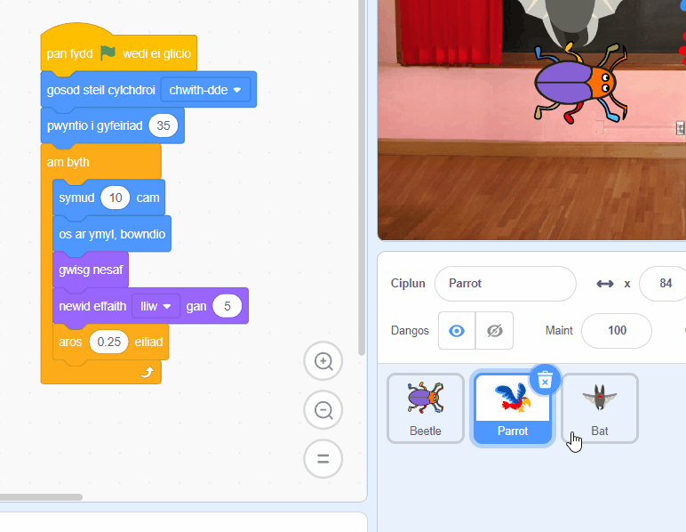

## Uwchraddio dy gêm

Os oes gen ti amser, galli di ychwanegu mwy o lefelau a mwy o bethau i dynnu sylw yn dy gêm. Fe allet ti hefyd newid y corlun sy'n cuddio a newid y testun ar y bwrdd du.

Dyma'r blociau y bydd eu hangen arnat i guddio'r chwilen ar lefel newydd:

```blocks3
when backdrop switches to [new level v]

set size to [20] %

go to x: [0] y: [0] // llusgo i roi lleoliad y chwilen yn gyntaf

set [color v] effect to [50]
```

--- task ---

Ar gyfer pob lefel, bydd angen i ti:
- Ychwanegu cefnlen
- Clicio ar y cwarel Llwyfan, wedyn ar y tab **Cefnlenni**, wedyn llusgo'r gefnlen newydd i'w safle cyn y gefnlen **diwedd**
- Ychwanega floc `pan fydd y gefnlen yn newid i`{:class="block3events"} ar gyfer y gefnlen newydd ac ychwanega god i roi lleoliad i'r chwilen a'i chuddio

**Awgrym:** I lusgo'r chwilen i le cuddio newydd, bydd angen i tu 'dorri' y cod fel nad ydy'r cefndir yn newid pan fyddi di'n clicio ar y chwilen i'w osod ar lefel newydd.

--- /task ---

--- task ---

Fe allet ti ychwanegu mwy o barotiaid neu ddewis corlun arall i dynnu sylw.

Dyma'r cod wnes di ei ddefnyddio ar gyfer y parot:
```blocks3
when flag clicked
set rotation style [left-right v] // peidio mynd wyneb i waered
point in direction [35] // rhif rhwng -180 a 180
forever // dal ati i fod yn annifyr
move [10] steps // mae'r rhif yn rheoli'r cyflymder
if on edge, bounce // aros ar y Llwyfan
next costume // fflapio
change [color v] effect by [5] // rho gynnig ar 11 neu 50
wait [0.25] seconds // rho gynnig ar 0.1 neu 0.5
end
```

**Awgrym:** Gallet ti lusgo cod y corlun **Parot** i gorlun arall i'w gwneud hi'n gyflymach i greu corlun tynnu sylw arall.



--- /task ---

--- collapse ---
---
title: Prosiect gorffenedig
---

Galli di weld y [prosiect wedi'i gwblhau yma](https://scratch.mit.edu/projects/486719939/){:target="_blank"}.

--- /collapse ---

--- save ---

