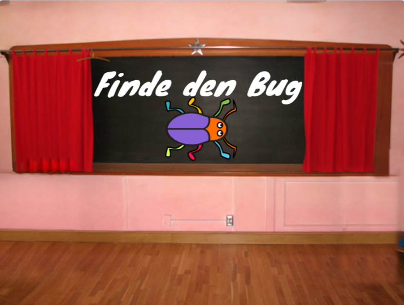
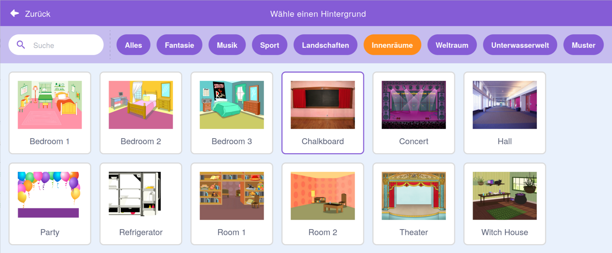

## Startbildschirm

Gib deinem Spiel einen Startbildschirm.

{:width="300px"}

### Öffne das Starterprojekt

--- task ---

Öffne das [Finde den Bug Starterprojekt](https://scratch.mit.edu/projects/582214723/editor){:target="_blank"}. Scratch wird in einem anderen Tab im Browser geöffnet.

[[[working-offline]]]

--- /task ---

### Füge einen Hintergrund hinzu

--- task ---

Füge den Hintergrund **Chalkboard** aus der Kategorie **Innenräume** hinzu.

--- /task ---

Die **Bühne** hat eine Registerkarte **Hintergrundbilder** anstelle einer Registerkarte **Kostüme**. Hier kannst du Bilder für die **Bühne** erstellen.

--- task ---

Klicke auf den Bühne-Bereich.

--- /task ---

### Bearbeite den Hintergrund

--- task ---

Klicke auf die Registerkarte **Hintergrundbilder**, um den Mal-Editor zu öffnen.

--- /task ---

--- task ---

Wähle **backdrop1** und klicke auf das Symbol **Löschen**, um den Hintergrund **backdrop1** aus deinem Projekt zu entfernen. Du brauchst **backdrop1** in diesem Projekt nicht.

--- /task ---

Der Hintergrund **Chalkboard** wird nun hervorgehoben.

--- task ---

Klicke auf **In Vektorgrafik umwandeln**. Jetzt kannst du Text hinzufügen, den du verschieben kannst.

--- /task ---

--- task ---

Verwende das Werkzeug **Text**, um den Text `Finde den Bug` auf die Tafel zu schreiben:

Wir haben die Schriftart **Marker** in Weiß verwendet, aber **wähle** die Schriftart und Farbe, die du verwenden möchtest.

**Tipp:** Wechsel zum **Auswählen** (Pfeil) Werkzeug, um deinen Text zu verschieben. Um die Größe des Texts zu ändern, fasse die Ecke des Texts an und ziehe daran.

--- /task ---

## Benenne den Hintergrund um

--- task ---

Ändere den Namen des Hintergrunds in `start`, da du ihn später im Projekt auswählen musst.

**Tipp:** Wenn du sinnvolle Namen verwendest, ist es einfacher, dein Projekt zu verstehen, insbesondere wenn du später zu einem Projekt zurückkommst.

--- /task ---

### Füge die Bug-Figur hinzu

--- task ---

Lösche die Figur **Scratch Cat**.

--- /task ---

--- task ---

Klicke auf **Figur wählen** und gib `bug` (engl.: Käfer) in das Suchfeld ein.

**Wähle:** Wähle einen Bug, den die Spieler in deinem Spiel finden müssen.

**Tipp:** Gib deinem Projekt einen Namen. Vielleicht möchtest du den Namen des Käfers angeben, den du gerade ausgewählt hast.

--- /task ---

Ein Fehler in einem Computerprogramm wird als **Bug** bezeichnet. Das Finden und Beseitigen von Fehlern in Computerprogrammen nennt man **Debugging** (sprichwörtlich: Entkäfern). Grace Hopper ist eine berühmte Softwareentwicklerin. Ihr Team fand einmal eine Motte in ihrem Computer. In ihren Notizen heißt es: „Der erste tatsächliche Fall, in dem ein Bug gefunden wurde.“

