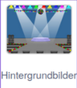
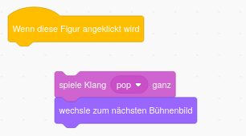
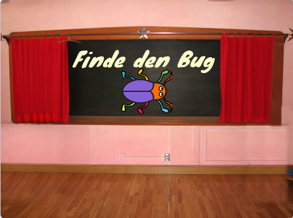
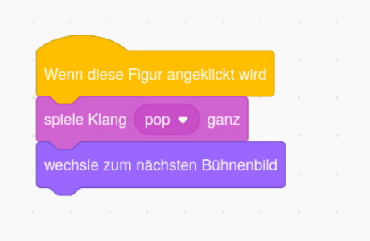

## Erstes Level

<div style="display: flex; flex-wrap: wrap">
<div style="flex-basis: 200px; flex-grow: 1; margin-right: 15px;">
Füge als erstes Level in deinem Spiel ein neues Hintergrundbild hinzu und verberge den Bug.
</div>
<div>

{:width="300px"}

</div>
</div>

### Füge einen weiteren Hintergrund hinzu

--- task ---

Füge den Hintergrund **Spotlight** aus der Kategorie **Musik** hinzu.


--- /task ---

### Ändere die Größe des Bugs

--- task ---

Click on the **bug** sprite in the Sprite list. Füge ein Skript hinzu, um die `Größe`{:class="block3looks"} deines Bugs zu ändern, `wenn das Bühnenbild zu Spotlight wechselt`{:class="block3events"}:


```blocks3
when backdrop switches to [Spotlight v]
set size to [20] % // tiny
```

--- /task ---

--- task ---

Klicke auf den Code, um die Größe zu ändern, und ziehe dann deinen kleinen Käfer in ein Versteck.

Füge Code hinzu, um deinen Bug zu positionieren:


```blocks3
when backdrop switches to [Spotlight v]
set size to [20] % // tiny
+ go to x: [13] y: [132] // on the disco ball
```

**Wähle:** Wenn du willst, kannst du eine andere Größe und eine andere Stelle wählen.

--- /task ---

### Gehe zum nächsten Hintergrundbild

Wenn du das Spiel spielst und den Bug erfolgreich findest, wechselt das Spiel zum nächsten Hintergrundbild. Und: um das Spiel zu starten, klickst du den Bug auf dem Startbildschirm.

Der Block `wechsle zum nächsten Bühnenbild`{:class="block3looks"} schaltet auf das nächste Bühnenbild in der Reihenfolge, in der die Bühnenbilder im Tab **Hintergrundbilder** der **Bühne** aufgeführt sind.

--- task ---

Add a script to your **bug** sprite to `play a Pop sound`{:class="block3sound"} and switch to the `next backdrop`{:class="block3looks"} `when this sprite is clicked`{:class="block3events"}:


```blocks3
when this sprite clicked
play sound [Pop v] until done
next backdrop
```

--- /task ---

### Starte das Spiel mit dem Startbildschirm

--- task ---

Klicke auf den Bühnenbereich und füge diesen Code zur **Bühne**hinzu:



```blocks3
when flag clicked
switch backdrop to [start v] // 'start' screen
```

--- /task ---

--- task ---

**Test:** Klicke auf die grüne Flagge, um dein Projekt zu testen.

Du wirst feststellen, dass der Bug auf dem 'start' Bildschirm immer noch die Einstellungen hat, sich in seinem Versteck aus dem ersten Level zu verstecken (in diesem Beispiel auf der Discokugel).

**Tipp:** Nach dem letzten Hintergrundbild in der Liste wechselt `wechsle zum nächsten Bühnenbild`{:class="block3looks"} zurück zum ersten Hintergrundbild.

--- /task ---

--- task ---

Click on the **bug** sprite in the Sprite list. Add a script to `set the size`{:class="block3looks"} of the bug when your `backdrop switches to`{:class="block3events"} the `start`{:class="block3events"} screen:


```blocks3
when backdrop switches to [start v]
set size to [100] % // full-sized
```

--- /task ---

### Ändere die Position des Bugs

--- task ---

Versuche, den Bug auf dem 'start' Bildschirm zu positionieren.

Dein Code bewirkt, dass das Hintergrundbild wechselt, wenn du auf den Bug klickst! Das ist nicht hilfreich, wenn du versuchst, den Bug zu positionieren.

Um das Problem zu beheben, musst du die Ausführung des Codes stoppen, wenn du auf den Bug klickst.

--- /task ---

--- task ---

Klicke auf die grüne Flagge, um zum 'start' Bildschirm zurückzukehren.

Klicke in der Figurenliste auf die Figur **bug** und ziehe die Blöcke vom Block `wenn diese Figur angeklickt wird`{:class="block3events"} weg:



--- /task ---

--- task ---

Versuch nochmal, den Käfer zu positionieren. Ziehe den Käfer auf die Tafel, unter den Text:



Add code to make sure that the bug is positioned on the chalkboard every time your `backdrop switches to`{:class="block3events"} the `start`{:class="block3events"} screen:


```blocks3
when backdrop switches to [start v]
set size to [100] % // full-sized
+ go to x: [0] y: [30] // on the board
```

--- /task ---

--- task ---

Füge die Blöcke wieder zusammen, sodass die Codeblöcke erneut unter dem Block `wenn diese Figur angeklickt wird`{:class="block3events"} liegen:



--- /task ---

--- task ---

**Test:** Klicke auf die grüne Flagge, um dein Projekt zu testen. Klick auf den Bug, um zum nächsten Hintergrundbild zu gelangen. Der Bug sollte auf dem 'start' Bildschirm groß und auf dem 'Spotlight' Level klein sein.

--- collapse ---
---
title: Es passiert nichts, wenn ich auf den Bug klicke
---

Hast du vergessen, den Code wieder mit dem Block `wenn diese Figur angeklickt wird`{:class="block3events"} zu verbinden?

--- /collapse ---

--- /task ---