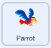
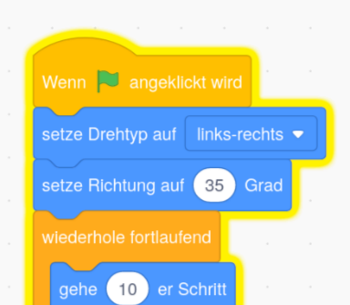

## Ablenkung durch einen Papageien

<div style="display: flex; flex-wrap: wrap">
<div style="flex-basis: 200px; flex-grow: 1; margin-right: 15px;">
Um es Spielern zu erschweren, den Bug zu finden und anzuklicken, füge einen nervigen Papagei hinzu, um sie abzulenken. 
</div>
<div>

{:width="300px"}

</div>
</div>

### Füge dis Papagei-Figur hinzu

--- task ---

Füge die **Papagei**-Figur hinzu.


--- /task ---

### Animiere die Papagei-Figur

Im Projekt [Erwische den Bus](https://projects.raspberrypi.org/de-DE/projects/catch-the-bus){:target="_blank"} hast Du eine `wiederhole`{:class="block3control"} Schleife verwendet.

Du wirst hier eine andere Schleife verwenden. Eine `wiederhole fortlaufend`{:class="block3control"} Schleife führt die darin enthaltenen Codeblöcke immer wieder aus. Es ist die perfekte Schleife für einen lästigen Papagei, der nicht aufhört, herumzufliegen und in die Quere zu kommen.

--- task ---

Füge Code hinzu, um den Papagei auf ablenkende Weise herumflattern zu lassen:




```blocks3
when flag clicked
set rotation style [links-rechts v] // nicht umdrehen
point in direction [35] // Zahlen von -180 bis 180
forever // bleib nervig
move [10] steps // die Zahl kontrolliert die Geschwindigkeit
if on edge, bounce // bleib auf der Bühne
next costume // schlage die Flügel
change [Farbe v] effect by [5] // versuche 11 oder 50
wait [0.25] seconds // versuche 0.1 oder 0.5
end
```

--- /task ---

--- task ---

**Test:** Klicke auf die grüne Flagge und teste dein Projekt erneut. Kannst du dich erinnern, wo du den Käfer versteckt hast?

In Scratch leuchtet der ausgeführte Code mit einer gelben Umrandung:



**Tipp:** Wenn der Papagei beim Programmieren zu nervig wird, kannst du auf die rote Stopp-Schaltfläche über der Bühne klicken, um die Ausführung des Codes zu stoppen.

--- /task ---

