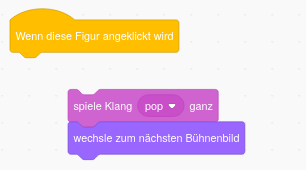

## Zweites Level

<div style="display: flex; flex-wrap: wrap">
<div style="flex-basis: 200px; flex-grow: 1; margin-right: 15px;">
Wähle einen Hintergrund, um das zweite Level für dein Spiel zu erstellen, und erhöhe die Schwierigkeit, den Bug zu finden. 
</div>
<div>

{:width="300px"}

</div>
</div>

### Füge einen weiteren Hintergrund hinzu

--- task ---

**Wähle:** Wähle ein Hintergrundbild für dein zweites Level. Wir haben den Hintergrund **Urban** ausgewählt, aber du kannst den auswählen, der dir am besten gefällt.


**Tipp:** Denke daran, dass Hintergründe mit vielen Farben und Details das Auffinden des Bugs erschweren. Wie schwierig wirst du dein Spiel machen?

--- /task ---

### Stoppe die Ausführung des Codes

--- task ---

Ziehe die Blöcke vom Block `Wenn diese Figur angeklickt wird`{:class="block3events"} weg, um zu verhindern, dass sie ausgeführt werden, wenn Du auf den Bug klickst:



--- /task ---

### Ändere die Größe des Bugs

--- task ---

Füge Code zu `setze Größe auf`{:class="block3looks"} hinzu und lege die Größe des Bugs für das zweite Level fest:


```blocks3
when backdrop switches to [Urban v] // wähle deinen Hintergrund
set size to [20] % // probiere eine andere Größe
```

**Test:** Klicke auf dein neues Skript, um es auszuführen.

--- /task ---

### Verstecke deinen Bug

--- task ---

Ziehe deinen Bug auf der Bühne an ein geeignetes Versteck für dieses Level.


--- /task ---

Platziere deinen Bug in seinem Versteck.

--- task ---

Füge deinem Code einen Block `gehe zu x: y:`{:class="block3motion"}“ hinzu:


```blocks3
when backdrop switches to [Urban v]
set size to [20] % // probiere eine andere Größe
+ go to x: [24] y: [13] // im Schaufenster
```

--- /task ---

### Teste deinen Code

--- task ---

Verbinde wieder die Blöcke mit dem `Wenn diese Figur angeklickt wird`{:class="block3events"}-Block, damit sich der Hintergrund `zum nächsten Bühnenbild wechselt`{:class="block3looks"}, sobald der Bug angeklickt wird:


--- /task ---

--- task ---

**Test:** Klicke auf die grüne Flagge, um dein Projekt zu testen.

--- /task ---

Möglicherweise befindet sich dein Bug jetzt vor dem Papagei.

--- task ---

Füge ein Skript hinzu, um sicherzustellen, dass dein Bug immer auf der `hintersten`{:class="block3looks"} Ebene ist:


```blocks3
when flag clicked
forever
go to [hinterster v] layer
```

Jetzt bleibt dein Bug immer im Hintergrund, auch wenn du seine Position ändern musst.

--- /task ---
