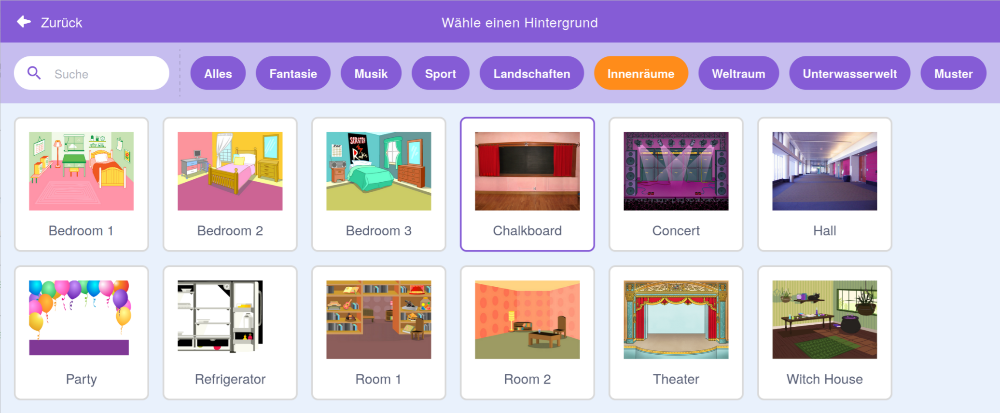
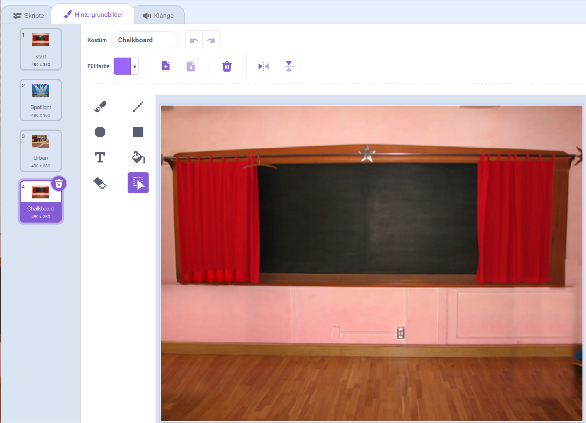
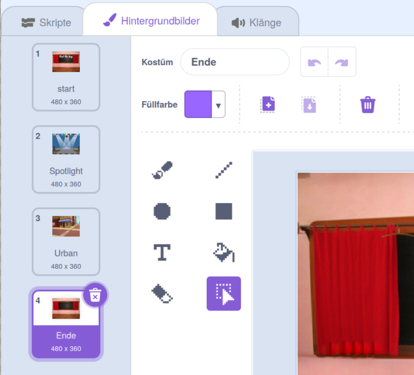

## Endbildschirm

<div style="display: flex; flex-wrap: wrap">
<div style="flex-basis: 200px; flex-grow: 1; margin-right: 15px;">
Erstelle einen Endbildschirm, um die Anzahl der Sekunden anzuzeigen, die der Spieler benötigt hat, um die Fehler zu finden. 
</div>
<div>

{:width="300px"}

</div>
</div>

<p style="border-left: solid; border-width:10px; border-color: #0faeb0; background-color: aliceblue; padding: 10px;">
Manchmal reicht es nicht aus, ein Spiel nur zu gewinnen. Spieler möchten gerne wissen, wie sie sich gegen andere Spieler oder gegen sich selbst geschlagen haben. Welches Spiel kennst du, das dir zeigt, wie gut du abgeschnitten hast?</p>

### Füge einen weiteren Hintergrund hinzu

--- task ---

Füge den Hintergrund **Chalkboard** aus der Kategorie **Innenräume** hinzu.



**Tipp:** In Scratch kannst du denselben Hintergrund mehrmals hinzufügen.

--- /task ---

### Bearbeite den Hintergrund

--- task ---

Klicke auf die Registerkarte **Hintergrundbilder**, um den Mal-Editor zu öffnen.



--- /task ---

--- task ---

Ändere den Namen des Hintergrundbilds in `Ende`:



**Tipp:** Du benennst den Hintergrund in **Ende** um, um das Verständnis deines Codes zu erleichtern.

--- /task ---

### Den Bug positionieren

--- task ---

Click on the **bug** sprite and add code to position the bug on the 'end' screen:


```blocks3
when backdrop switches to [end v]
set size to [100] % // full-sized
go to x: [0] y: [30] // on the board
```

--- /task ---

### Eine Stoppuhr hinzufügen

Wie lange dauert es, den Bug zu finden und anzuklicken? Scratch verfügt über eine `Stoppuhr`{:class="block3sensing"}, mit dem du das herausfinden kannst.

--- task ---

Der Block `Stoppuhr`{:class="block3sensing"} befindet sich im Blockmenü `Fühlen`{:class="block3sensing"}. Add code to make the bug `say`{:class="block3looks"} the `timer`{:class="block3sensing"} on the 'end' screen:


```blocks3
when backdrop switches to [end v]
set size to [100] % // full-sized
go to x: [0] y: [30] // on the board
+say (timer) // seconds taken
```


--- /task ---

--- task ---

**Test:** Klicke auf die grüne Flagge, um deine Suchkünste auf die Probe zu stellen. Wie lange dauert es, den Bug zu finden und anzuklicken?

--- /task ---

Um zum 'Start' Bildschirm zurückzukehren, klicke auf den Bug im "Ende' Bildschirm.

--- task ---

Füge Code hinzu, damit der Bug aufhört, die `Stoppuhr`{:class="block3sensing"} anzuzeigen, wenn du zum 'Start' Bildschirm gehst:


```blocks3
when backdrop switches to [start v]
set size to [100] % // full-sized
go to x: [0] y: [30] // on the board
+say [] // say nothing
```

--- /task ---

### Halte die Stoppuhr an

Wenn du das Spiel ein zweites Mal spielst, zählt die `Stoppuhr`{:class="block3sensing"} weiter.

--- task ---

Add code to `reset the timer`{:class="block3sensing"} when the `backdrop switches to`{:class="block3events"} the first level:


```blocks3
when backdrop switches to [Spotlight v] // first level
set size to [20] % // tiny
go to x: [13] y: [132] // on the disco ball
+reset timer // start the timer
```

--- /task ---

--- task ---

**Test:** Klicke auf die grüne Flagge und spiele das Spiel. Die Stoppuhr sollte zurückgesetzt werden, wenn du auf dem Startbildschirm auf den Bug klickst, um zum ersten Level zu gelangen. Wenn du auf dem „Ende“ Bildschirm auf den Bug klickst, solltest du zum „Start“ Bildschirm zurückkehren und sehen, dass der Bug die `Stoppuhr`{:class="block3sensing"} nicht anzeigt.

--- /task ---

