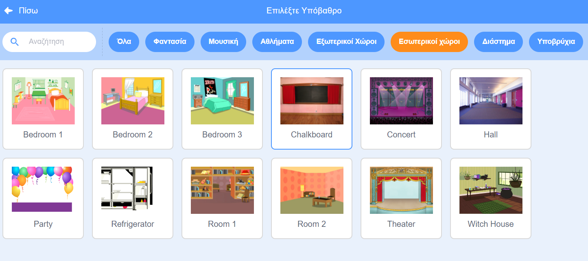

## Αρχική Οθόνη

Το παιχνίδι σου θα ξεκινήσει με μια οθόνη «start» και οι παίκτες θα κάνουν κλικ στο έντομο για να μεταβούν στο πρώτο επίπεδο.

{:width="300px"}

--- task ---

Open the [Find the bug starter project](https://scratch.mit.edu/projects/582214723/editor){:target="_blank"}. Το Scratch θα ανοίξει σε νέα καρτέλα του φυλλομετρητή.

[[[working-offline]]]

--- /task ---

--- task ---

Πρόσθεσε το υπόβαθρο **Chalkboard** από την κατηγορία **Εσωτερικοί Χώροι**.

--- /task ---

Η **Σκηνή** έχει μια καρτέλα **Υπόβαθρα** αντί για μια καρτέλα **Ενδυμασίες**. Εδώ μπορείς να δημιουργήσεις εικόνες για τη **Σκηνή**.

--- task ---

Κάνε κλικ στη Σκηνή.

--- /task ---

--- task ---

Κάνε κλικ στην καρτέλα **Υπόβαθρα** για να ανοίξεις το πρόγραμμα ζωγραφικής.

--- /task ---

--- task ---

Επίλεξε **υπόβαθρο1** και κάνε κλικ στο **Διαγραφή** για να αφαιρέσεις το υπόβαθρο **υπόβαθρο1** από το έργο σου. Δεν θα χρειαστείς το υπόβαθρο **υπόβαθρο1** σε αυτό το έργο.

--- /task ---

Το υπόβαθρο1 **Chalkboard** θα είναι τώρα επιλεγμένο.

--- task ---

Κάνε κλικ στο **Μετατροπή σε Ψηφιοαπεικόνιση (bitmap)**. Τώρα, θα μπορέσεις να προσθέσεις κείμενο που μπορείς να το μετακινήσεις.

--- /task ---

--- task ---

Χρησιμοποίησε το εργαλείο **Κείμενο** για να προσθέσεις το κείμενο `Βρες το έντομο` στον πίνακα κιμωλίας:

Χρησιμοποιήσαμε τη γραμματοσειρά**San Serif** σε λευκό, αλλά **επίλεξε** τη γραμματοσειρά και το χρώμα που θέλεις να χρησιμοποιήσεις.

**Συμβουλή:** Πήγαινε στο εργαλείο **Επιλογή** (βελάκι) για να μετακινήσεις το κείμενό σου. Για να αλλάξεις το μέγεθος του κειμένου, πιάσε τη γωνία του κειμένου και σύρε το.

--- /task ---

--- task ---

Άλλαξε το όνομα του υπόβαθρου σε `start`, γιατί θα χρειαστεί να το επιλέξεις αργότερα στο έργο.

**Συμβουλή:** Εάν χρησιμοποιείς ονόματα που έχουν νόημα, θα είναι ευκολότερο να κατανοήσεις το έργο σου, ειδικά όταν επιστρέψεις σε ένα έργο αργότερα.

--- /task ---

--- task ---

Διάγραψε το Αντικείμενο **Scratch Cat**.

--- /task ---

--- task ---

Κάνε κλικ στο **Επιλέξτε ένα Αντικείμενο** και πληκτρολόγησε `bug` στο πλαίσιο αναζήτησης.

**Επίλεξε:** Επίλεξε ένα έντομο, το οποίο οι παίκτες θα πρέπει να βρουν στο παιχνίδι σου.

**Συμβουλή:** Δώσε ένα όνομα στο έργο σου. Ίσως θέλεις να συμπεριλάβεις το όνομα του εντόμου που μόλις επέλεξες.

--- /task ---

Ένα λάθος σε ένα πρόγραμμα υπολογιστή ονομάζεται **bug** (σφάλμα). Η εύρεση και η αφαίρεση λαθών σε προγράμματα υπολογιστών ονομάζεται **εντοπισμός σφαλμάτων** (debugging). Η Grace Hopper είναι μια διάσημη μηχανικός λογισμικού. Η ομάδα της βρήκε κάποτε έναν σκόρο στον υπολογιστή τους. Οι σημειώσεις τους λένε, "Πρώτη πραγματική περίπτωση εντοπισμού bug."

--- save ---

