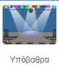
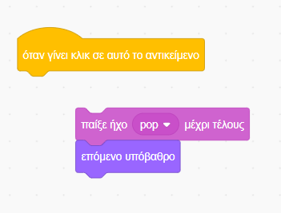
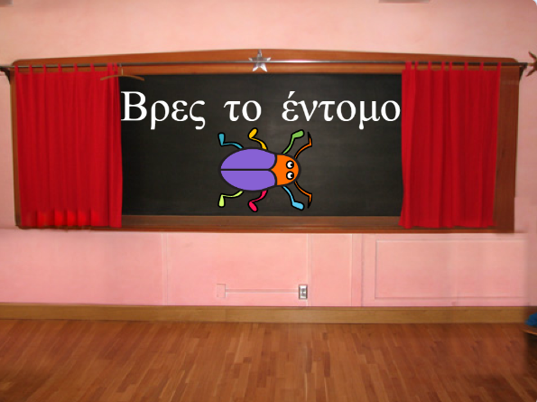
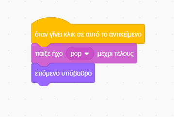

## Πρώτο επίπεδο

<div style="display: flex; flex-wrap: wrap">
<div style="flex-basis: 200px; flex-grow: 1; margin-right: 15px;">
Θα προσθέσεις ένα νέο υπόβαθρο ως πρώτο επίπεδο στο παιχνίδι σου και θα κρύψεις το έντομο.
</div>
<div>

{:width="300px"}

</div>
</div>

--- task ---

Πρόσθεσε το υπόβαθρο **Spotlight** από την κατηγορία **Μουσική**.


--- /task ---

--- task ---

Κάνε κλικ στο αντικείμενο **bug** στη λίστα αντικειμένων. Πρόσθεσε ένα script για να αλλάξεις το `μέγεθος`{:class="block3looks"} του εντόμου `όταν το υπόβαθρο αλλάζει σε Spotlight`{:class="block3events"}:


```blocks3
when backdrop switches to [Spotlight v]
set size to [20] % // μικροσκοπικός
```

--- /task ---

--- task ---

Κάνε κλικ στον κώδικα για να αλλάξεις το μέγεθος και, στη συνέχεια, σύρε το μικροσκοπικό σου έντομο σε μια κρυψώνα.

Πρόσθεσε κώδικα για να τοποθετήσεις το έντομό σου:


```blocks3
when backdrop switches to [Spotlight v]
set size to [20] % // μικροσκοπικός
+ go to x: [13] y: [132] // πάνω στη μπάλα της disco
```

**Επίλεξε:** Μπορείς να επιλέξεις διαφορετικό μέγεθος και τοποθεσία, αν προτιμάς.

--- /task ---

Όταν παίζεις το παιχνίδι και βρεις με επιτυχία το έντομο, το παιχνίδι θα αλλάξει στο επόμενο υπόβαθρο. Επίσης, για να ξεκινήσεις το παιχνίδι, θα κάνεις κλικ στο έντομο στην οθόνη 'αρχή'.

Το μπλοκ `επόμενο υπόβαθρο`{:class="block3looks"} αλλάζει στο επόμενο υπόβαθρο με τη σειρά με την οποία εμφανίζονται τα υπόβαθρα όταν κάνεις κλικ στην καρτέλα **Υπόβαθρα** στην **Σκηνή**.

--- task ---

Πρόσθεσε ένα script στο αντικείμενο σου **bug** για να `παίξει τον ήχο Pop`{:class="block3sound"} και πήγαινε στο `επόμενο υπόβαθρο`{:class="block3looks"} `όταν γίνει κλικ σε αυτό το αντικείμενο`{:class="block3events"}:


```blocks3
when this sprite clicked
play sound [Pop v] until done
next backdrop
```

--- /task ---

Το έργο σου πρέπει να ξεκινήσει από την οθόνη "αρχή".

--- task ---

Κάνε κλικ στο παράθυρο της Σκηνής και πρόσθεσε αυτόν τον κώδικα στη **Σκηνή**:



```blocks3
when flag clicked
switch backdrop to [αρχή v] // οθόνη 'αρχή'
```

--- /task ---

--- task ---

**Δοκιμή:** Κάνε κλικ στην πράσινη σημαία για να δοκιμάσεις το έργο σου.

Θα παρατηρήσεις ότι στην οθόνη "έναρξη", το έντομο θα εξακολουθεί να έχει τις ρυθμίσεις για να κρύβεται στην κρυψώνα του από το πρώτο επίπεδο (σε αυτό το παράδειγμα, στη μπάλα της ντίσκο).

**Συμβουλή:** Μετά το τελευταίο υπόβαθρο στη λίστα, το `επόμενο υπόβαθρο`{:class="block3looks"} θα επιστρέψει στο πρώτο φόντο.

--- /task ---

--- task ---

Κάνε κλικ στο αντικείμενο **bug** στη λίστα αντικειμένων. Πρόσθεσε ένα script στο έντομο για να `ορίσεις το μέγεθος` του{:class="block3looks"} όταν το `υπόβαθρο αλλάζει`{:class="block3events"} στην οθόνη `αρχή`{:class="block3events"}:


```blocks3
when backdrop switches to [αρχή v]
set size to [100] % // πλήρους μεγέθους
```

--- /task ---

--- task ---

Προσπάθησε να τοποθετήσεις το έντομο στην οθόνη "αρχή".

Ο κώδικας σου θα κάνει το υπόβαθρο να αλλάξει όταν κάνεις κλικ στο έντομο! Αυτό δεν είναι χρήσιμο όταν προσπαθείς να τοποθετήσεις το έντομο.

--- /task ---

Για να διορθώσεις το πρόβλημα, πρέπει να σταματήσεις την εκτέλεση του κώδικα όταν κάνεις κλικ στο έντομο.

--- task ---

Κάνε κλικ στην πράσινη σημαία για να επιστρέψεις στην οθόνη "αρχή".

Κάνε κλικ στο αντικείμενο **bug** στη λίστα Αντικειμένων και σύρε τα μπλοκ μακριά από το `όταν γίνει κλικ σε αυτό το αντικείμενο`{:class="block3events"}:



--- /task ---

--- task ---

Προσπάθησε να τοποθετήσεις το έντομο ξανά. Σύρε το έντομο στον πίνακα κιμωλίας, κάτω από το κείμενο:



Πρόσθεσε κώδικα για να βεβαιωθείς ότι το έντομο τοποθετείται στον πίνακα κιμωλίας κάθε φορά που το `υπόβαθρο αλλάζει στην`{:class="block3events"} οθόνη `αρχή`{:class="block3events"}:


```blocks3
when backdrop switches to [αρχή v]
set size to [100] % // πλήρους μεγέθους
+ go to x: [0] y: [30] // πάνω στον πίνακα
```

--- /task ---

--- task ---

Σύνδεσε ξανά τα μπλοκ έτσι ώστε τα μπλοκ κώδικα να είναι κάτω από το `όταν γίνει κλικ σε αυτό το αντικείμενο`{:class="block3events"}:



--- /task ---

--- task ---

**Δοκιμή:** Κάνε κλικ στην πράσινη σημαία για να δοκιμάσεις το έργο σου. Κάνε κλικ στο έντομο για να μεταφερθείς στο επόμενο υπόβαθρο. Το έντομο θα πρέπει να είναι μεγάλο στην οθόνη "αρχή" και μικρό στο επίπεδο "Spotlight".

--- collapse ---
---
title: Δεν συμβαίνει τίποτα όταν κάνω κλικ στο έντομο
---

Ξέχασες να ενώσεις τον κώδικα στο μπλοκ `όταν γίνει κλικ σε αυτό το αντικείμενο`{:class="block3events"};

--- /collapse ---

--- /task ---

--- save ---
