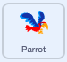

## Ένας παπαγάλος αποσπά την προσοχή

<div style="display: flex; flex-wrap: wrap">
<div style="flex-basis: 200px; flex-grow: 1; margin-right: 15px;">
Για να είναι πιο δύσκολο για τους παίκτες να βρουν και να κάνουν κλικ στο έντομο, θα προσθέσεις έναν ενοχλητικό παπαγάλο για να τους αποσπά την προσοχή. 
</div>
<div>

{:width="300px"}

</div>
</div>

--- task ---

Πρόσθεσε το αντικείμενο **Parrot**.


--- /task ---

Στο έργο [Πρόλαβε το λεωφορείο](https://projects.raspberrypi.org/en/projects/catch-the-bus){:target="_blank"}, χρησιμοποίησες ένα βρόχο `επανάλαβε`{:class="block3control"}.

Εδώ θα χρησιμοποιήσεις διαφορετικό βρόχο. Ένας βρόχος `για πάντα`{:class="block3control"} εκτελεί τα μπλοκ κώδικα μέσα στον βρόχο ξανά και ξανά. Είναι ο τέλειος βρόχος για έναν ενοχλητικό παπαγάλο που δεν θα σταματήσει να πετάει και να εμποδίζει.

--- task ---

Πρόσθεσε κώδικα για να κάνεις τον παπαγάλο να φτερουγίζει με τρόπο που να αποσπά την προσοχή:




```blocks3
when flag clicked
set rotation style [left-right v] // do not go upside down
point in direction [35] // number from -180 to 180
forever // keep being annoying
move [10] steps // the number controls the speed
if on edge, bounce // stay on the Stage
next costume // flap
change [color v] effect by [5] // try 11 or 50
wait [0.25] seconds // try 0.1 or 0.5
end
```

--- /task ---

--- task ---

**Δοκιμή:** Κάνε κλικ στην πράσινη σημαία και δοκίμασε το έργο σου πάλι. Μπορείς να θυμηθείς πού έκρυψες το έντομο;

Στο Scratch, ο κώδικας που εκτελείται έχει ένα κίτρινο περίγραμμα:


**Συμβουλή:** Εάν ο παπαγάλος γίνει πολύ ενοχλητικός ενώ κάνεις τον κώδικά σου, μπορείς να κάνεις κλικ στο κόκκινο κουμπί διακοπής πάνω από τη Σκηνή για να σταματήσεις την εκτέλεση του κώδικα.

--- /task ---

--- save ---
