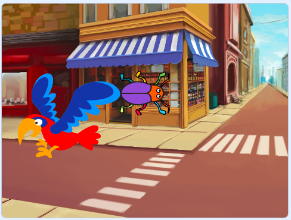

## Δεύτερο επίπεδο

<div style="display: flex; flex-wrap: wrap">
<div style="flex-basis: 200px; flex-grow: 1; margin-right: 15px;">
Θα επιλέξεις ένα υπόβαθρο για να δημιουργήσεις ένα δεύτερο επίπεδο για το παιχνίδι σου και να κάνεις το έντομο δυσεύρετο. 
</div>
<div>

{:width="300px"}

</div>
</div>

### Πρόσθεσε κι άλλο υπόβαθρο

--- task ---

**Επίλεξε:** Επίλεξε ένα υπόβαθρο για το δεύτερο επίπεδο. Επιλέξαμε το υπόβαθρο **Urban**, αλλά μπορείς να επιλέξεις αυτό που σου αρέσει περισσότερο.



**Συμβουλή:** Να θυμάσαι ότι τα υπόβαθρα με πολλά χρώματα και λεπτομέρειες θα κάνουν το έντομο πιο δύσκολο να βρεθεί. Πόσο δύσκολο θα κάνεις το παιχνίδι σου;

--- /task ---

### Σταμάτα την εκτέλεση του κώδικα

--- task ---

Σύρε τα μπλοκ μακριά από το μπλοκ `όταν γίνει κλικ σε αυτό το αντικείμενο` {:class="block3events"} για να σταματήσειη εκτέλεση όταν κάνεις κλικ στο έντομο:


--- /task ---

### Αλλαγή μεγέθους του εντόμου

--- task ---

Πρόσθεσε κώδικα για να `ορίσεις το μέγεθος`{:class="block3looks"} του εντόμου για το δεύτερο επίπεδο:


```blocks3
when backdrop switches to [Urban v] // choose your backdrop
set size to [20] % // try another size 
```

**Δοκιμή:** Κάνε κλικ στο νέο σου script για να το εκτελέσεις.

--- /task ---

### Κρύψε το έντομό σου

--- task ---

Σύρε το έντομό σου στη Σκηνή σε μια καλή κρυψώνα γι' αυτό το επίπεδο.


--- /task ---

Τοποθέτησε το έντομό σου στην κρυψώνα του.

--- task ---

Πρόσθεσε ένα μπλοκ `πήγαινε σε θέση x, y`{:class="block3motion"} στον κώδικά σου:


```blocks3
when backdrop switches to [Urban v]
set size to [20] % // try another size 
+ go to x: [24] y: [13] // in the shop window
```

--- /task ---

### Δοκίμασε τον κώδικά σου

--- task ---

Σύνδεσε πάλι τα μπλοκ με το μπλοκ `όταν γίνει κλικ σε αυτό το αντικείμενο`{:class="block3events"}, έτσι ώστε όταν γίνει κλικ στο έντομο, το υπόβαθρο να αλλάξει στο `επόμενο υπόβαθρο`{:class="block3looks"}:


--- /task ---

--- task ---

**Δοκιμή:** Κάνε κλικ στην πράσινη σημαία για να δοκιμάσεις το έργο σου.

--- /task ---

Το έντομό σου μπορεί τώρα να βρίσκεται μπροστά από τον παπαγάλο.

--- task ---

Πρόσθεσε ένα script για να βεβαιωθείς ότι το έντομό σου βρίσκεται πάντα `πίσω`{:class="block3looks"}:


```blocks3
when flag clicked
forever
go to [back v] layer
```

Τώρα, το έντομό σου θα παραμένει πάντα στο πίσω μέρος, ακόμα κι αν χρειαστεί να αλλάξεις τη θέση του.

--- /task ---
