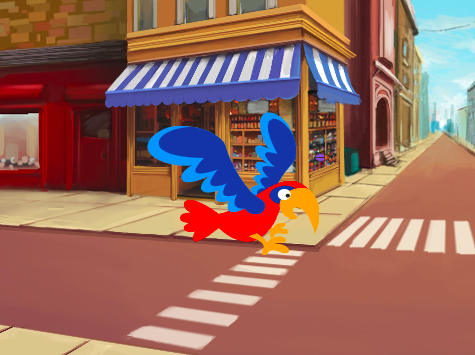

## Δεύτερο επίπεδο

<div style="display: flex; flex-wrap: wrap">
<div style="flex-basis: 200px; flex-grow: 1; margin-right: 15px;">
Choose a backdrop to make a second level for your game, and make the bug hard to find. 
</div>
<div>

{:width="300px"}

</div>
</div>

### Add another backdrop

--- task ---

**Επίλεξε:** Επίλεξε ένα υπόβαθρο για το δεύτερο επίπεδο. Επιλέξαμε το υπόβαθρο **Urban**, αλλά μπορείς να επιλέξεις αυτό που σου αρέσει περισσότερο.


**Συμβουλή:** Να θυμάσαι ότι τα υπόβαθρα με πολλά χρώματα και λεπτομέρειες θα κάνουν το έντομο πιο δύσκολο να βρεθεί. Πόσο δύσκολο θα κάνεις το παιχνίδι σου;

--- /task ---

### Stop the code from running

--- task ---

Drag the blocks away from the `when this sprite clicked`{:class="block3events"} block to stop them from running when you click on the bug:


--- /task ---

### Resize the bug

--- task ---

Add code to `set the size`{:class="block3looks"} of the bug for the second level:


```blocks3
when backdrop switches to [Urban v] // choose your backdrop
set size to [20] % // try another size 
```

**Test:** Click on your new script to run it.

--- /task ---

### Hide your bug

--- task ---

Drag your bug on the Stage to a good hiding place for this level.


--- /task ---

Position your bug in its hiding place.

--- task ---

Add a `go to x: y:`{:class="block3motion"} block to your code:


```blocks3
when backdrop switches to [Urban v]
set size to [20] % // try another size 
+ go to x: [24] y: [13] // in the shop window
```

--- /task ---

### Test your code

--- task ---

Join the blocks back to the `when this sprite clicked`{:class="block3events"} block so that when the bug is clicked, the backdrop switches to the `next backdrop`{:class="block3looks"}:


--- /task ---

--- task ---

**Test:** Click on the green flag to test your project.

--- /task ---

Your bug may now be in front of the parrot.

--- task ---

Add a script to make sure that your bug is always at the `back`{:class="block3looks"}:


```blocks3
when flag clicked
forever
go to [back v] layer
```

Now, your bug will always stay at the back, even if you need to change its position.

--- /task ---
