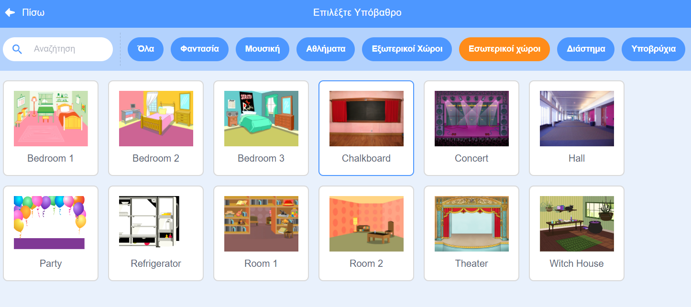
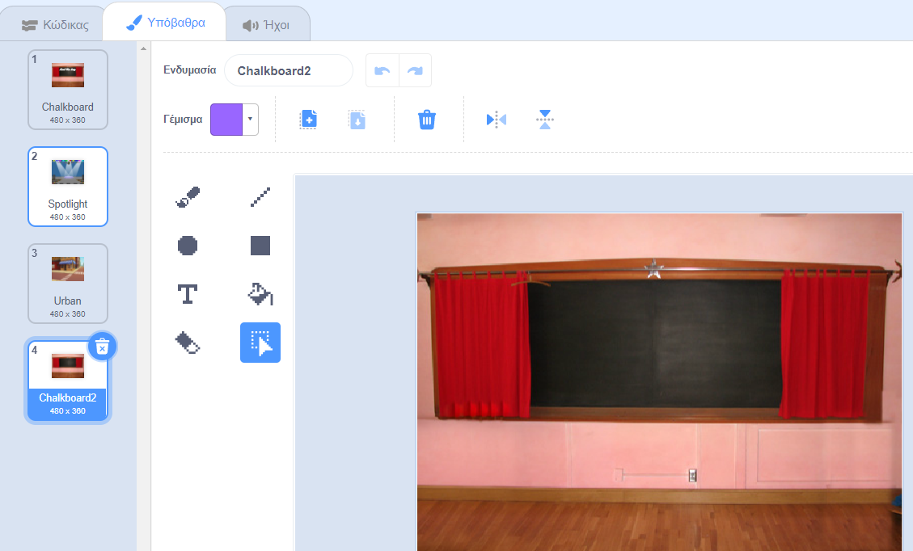
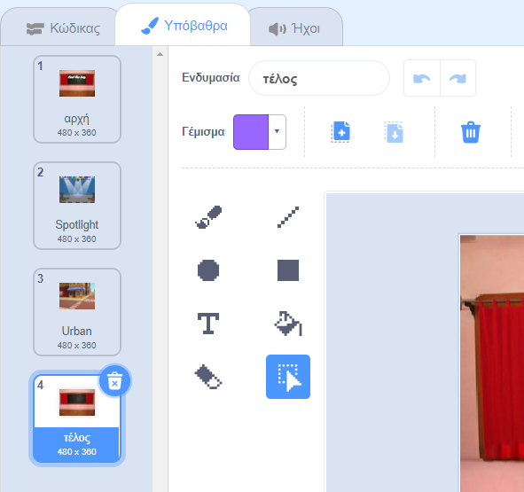
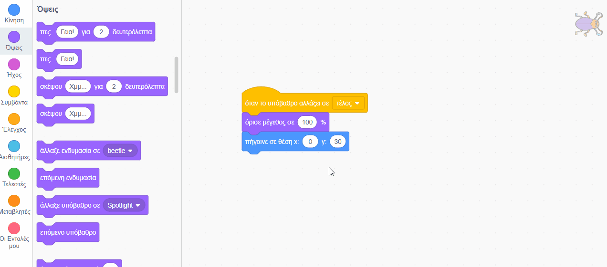

## Τελική οθόνη (end)

<div style="display: flex; flex-wrap: wrap">
<div style="flex-basis: 200px; flex-grow: 1; margin-right: 15px;">
Θα δημιουργήσεις μια οθόνη "end" για να εμφανίσεις τον αριθμό των δευτερολέπτων που χρειάστηκε ο παίκτης για να βρει τα έντομα. 
</div>
<div>

! [Το έντομο με το χρονικό διάστημα σε ένα συννεφάκι ομιλίας.] (Images/end-screen.png) {: width = "300px"}

</div>
</div>

<p style="border-left: solid; border-width:10px; border-color: #0faeb0; background-color: aliceblue; padding: 10px;">
Μερικές φορές, το να νικάς ένα παιχνίδι δεν είναι αρκετό. Στους παίκτες αρέσει να γνωρίζουν πόσο καλά τα πήγαν απέναντι σε άλλους παίκτες ή στον εαυτό τους. Μπορείς να σκεφτείς ένα παιχνίδι που να σου δείχνει πόσο καλά τα κατάφερες;</p>

### Πρόσθεσε κι άλλο υπόβαθρο

--- task ---

Πρόσθεσε το υπόβαθρο **Chalkboard** από την κατηγορία **Εσωτερικοί Χώροι**.



**Συμβουλή:** Στο Scratch, μπορείς να προσθέσεις το ίδιο υπόβαθρο περισσότερες από μία φορές.

--- /task ---

### Επεξεργάσου το υπόβαθρο

--- task ---

Κάνε κλικ στην καρτέλα **Υπόβαθρα** για να ανοίξεις το πρόγραμμα ζωγραφικής.



--- /task ---

--- task ---

Άλλαξε το όνομα του υπόβαθρου σε `end`:



**Συμβουλή:** Μετονομάζεις το υπόβαθρο σε **end** (τέλος) για να γίνει ευκολότερη η κατανόηση του κώδικά σου.

--- /task ---

### Τοποθέτησε το έντομο

--- task ---

Κάνε κλικ στο αντικείμενο **bug** και πρόσθεσε κώδικα για να τοποθετήσεις το έντομο στην οθόνη «end»:


```blocks3
when backdrop switches to [end v]
set size to [100] % // full-sized
go to x: [0] y: [30] // on the board
```

--- /task ---

### Πρόσθεσε ένα χρονόμετρο

Πόσο χρόνο χρειάστηκες για να βρεις και να κάνεις κλικ στα έντομα; Το Scratch έχει ένα `χρονόμετρο `{:class="block3sensing"} που μπορείς να χρησιμοποιήσεις για να μάθεις.

--- task ---

Το μπλοκ `χρονόμεντρο`{:class="block3sensing"} βρίσκεται στο μενού `Αισθητήρες`{:class="block3sensing"}. Πρόσθεσε κώδικα για να κάνεις το έντομο να `πει`{:class="block3looks"} το `χρονόμετρο`{:class="block3sensing"} στην οθόνη "end":


```blocks3
when backdrop switches to [end v]
set size to [100] % // full-sized
go to x: [0] y: [30] // on the board
+say (timer) // seconds taken
```



--- /task ---

--- task ---

**Δοκιμή:** Κάνε κλικ στην πράσινη σημαία για να δοκιμάσεις τις δεξιότητές σου στην αναζήτηση των εντόμων. Πόσο χρόνο χρειάστηκες για να βρεις το έντομο;

--- /task ---

Για να επιστρέψεις στην οθόνη "start", κάνε κλικ στο έντομο στην οθόνη "end".

--- task ---

Πρόσθεσε κώδικα για να σταματήσεις το έντομο να λέει το `χρονόμετρο`{:class="block3sensing"} όταν πηγαίνεις στην οθόνη "start":


```blocks3
when backdrop switches to [start v]
set size to [100] % // full-sized
go to x: [0] y: [30] // on the board
+say [] // say nothing
```

--- /task ---

### Σταμάτησε το χρονόμετρο

Εάν παίξεις το παιχνίδι δεύτερη φορά, το `χρονόμετρο`{:class="block3sensing"} θα συνεχίσει να μετράει.

--- task ---

Πρόσθεσε κώδικα για να `μηδενίσεις το χρονόμετρο`{:class="block3sensing"} όταν το `υπόβαθρο αλλάξει σε`{:class="block3events"} πρώτο επίπεδο:


```blocks3
when backdrop switches to [Spotlight v] // first level
set size to [20] % // tiny
go to x: [13] y: [132] // on the disco ball
+reset timer // start the timer
```

--- /task ---

--- task ---

**Δοκιμή:** Κάνε κλικ στην πράσινη σημαία και παίξε το παιχνίδι. Το χρονόμετρο πρέπει να μηδενιστεί όταν κάνεις κλικ στο έντομο στην οθόνη "start" για να μετακινηθείς στο πρώτο επίπεδο. Όταν κάνεις κλικ στο έντομο στην οθόνη "end", θα πρέπει να επιστρέψεις στην οθόνη "start" και να δεις ότι το έντομο δεν λέει το `χρονόμετρο`{:class="block3sensing"}.

--- /task ---

