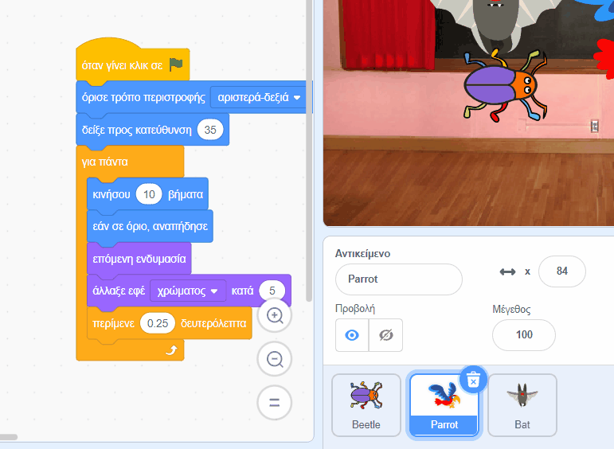

## Αναβάθμισε το παιχνίδι σου

Εάν έχεις χρόνο, μπορείς να προσθέσεις περισσότερα επίπεδα και περισσότερους περισπασμούς στο παιχνίδι σου. Θα μπορούσες επίσης να αλλάξεις το αντικείμενο που κρύβεται και να αλλάξεις το κείμενο στον πίνακα κιμωλίας.

--- task ---

Παίξε το παιχνίδι σου και δες πόσο γρήγορα μπορείς να βρεις τα έντομα.

Υπάρχει κάποιος άλλος που μπορεί να δοκιμάσει το παιχνίδι σου; Πόσο γρήγορα μπορούν να βρουν τα έντομα; Δεν θα ξέρουν πού τα έχεις κρύψει, οπότε μπορεί να τους πάρει λίγο περισσότερο χρόνο!

Υπάρχει κάτι που θέλεις να αλλάξεις;

Θα μπορούσες να:
- Κάνεις τον παπαγάλο ακόμα πιο ενοχλητικό
- Κάνεις τα έντομα μικρότερα
- Αλλάξεις το `εφέ χρώματος`{:class="block3looks"} για να καμουφλάρεις το έντομο σε κάθε επίπεδο
- Αλλάξεις τη γραμματοσειρά ή το χρώμα του κειμένου

--- /task ---

### Προσθέσεις περισσότερα επίπεδα

--- task ---

Εδώ είναι τα μπλοκ που θα χρειαστείς για να κρύψεις το έντομο σε ένα νέο επίπεδο:

```blocks3
when backdrop switches to [new level v]

set size to [20] %

go to x: [0] y: [0] // drag to position the bug first

set [color v] effect to [50]
```

Για κάθε επίπεδο, θα χρειαστεί να:
- Προσθέσεις ένα υπόβαθρο
- Κάνεις κλικ στο παράθυρο Σκηνή, στη συνέχεια στην καρτέλα **Υπόβαθρα** και, στη συνέχεια, να σύρεις το νέο υπόβαθρο σε μια θέση πριν από το υπόβαθρο **end**
- Προσθέσεις ένα μπλοκ `όταν το υπόβαθρο αλλάξει σε`{:class="block3events"} για το νέο υπόβαθρο και να προσθέσεις κώδικα για να τοποθετήσεις και να κρύψεις το έντομο

**Συμβουλή:** Για να σύρεις το έντομο σε μια νέα θέση κρυψώνας, θα χρειαστεί να «σπάσεις» τον κώδικα έτσι ώστε το υπόβαθρο να μην αλλάζει όταν κάνεις κλικ στο έντομο για να το τοποθετήσεις σε νέο επίπεδο.

--- /task ---

### Πρόσθεσε περισσότερους περισπασμούς

--- task ---

Θα μπορούσες να προσθέσεις περισσότερους παπαγάλους ή να επιλέξεις ένα άλλο αντικείμενο που θα αποσπά την προσοχή.

Εδώ είναι ο κώδικας που χρησιμοποίησες για τον παπαγάλο:

```blocks3
when flag clicked
set rotation style [left-right v] // do not go upside down
point in direction [35] // number from -180 to 180
forever // keep being annoying
move [10] steps // the number controls the speed
if on edge, bounce // stay on the Stage
next costume // flap
change [color v] effect by [5] // try 11 or 50
wait [0.25] seconds // try 0.1 or 0.5
end
```

**Συμβουλή:** Μπορείς να σύρεις τον κώδικα του αντικειμένου **Parrot** σε ένα άλλο αντικείμενο για να δημιουργήσεις πιο γρήγορα ένα άλλο αντικείμενο που θα αποσπά την προσοχή.



--- /task ---

--- collapse ---
---
title: Ολοκληρωμένο έργο
---

Μπορείς να δεις το [ολοκληρωμένο το έργο εδώ](https://scratch.mit.edu/projects/486719939/){:target="_blank"}.

--- /collapse ---