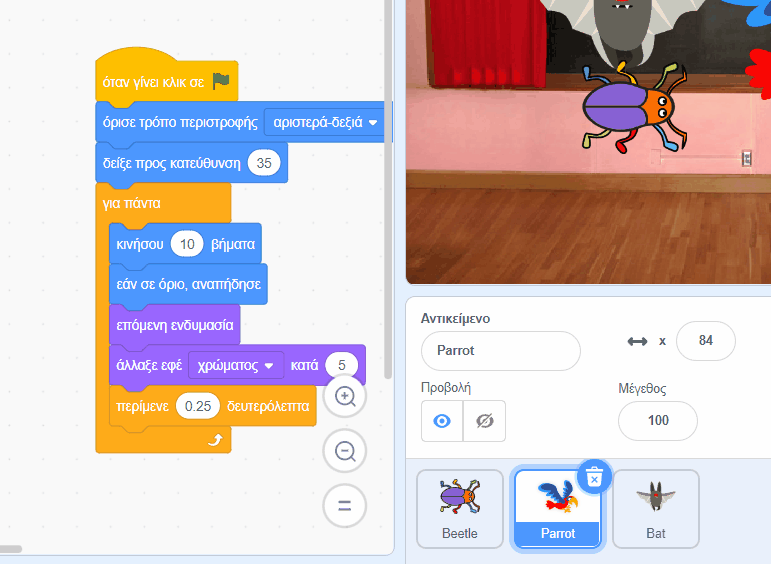

## Αναβάθμισε το έργο σου

Εάν έχεις χρόνο, μπορείς να προσθέσεις περισσότερα επίπεδα και περισσότερους περισπασμούς στο παιχνίδι σου. Θα μπορούσες επίσης να αλλάξεις το αντικείμενο που κρύβεται και να αλλάξεις το κείμενο στον πίνακα κιμωλίας.

Εδώ είναι τα μπλοκ που θα χρειαστείς για να κρύψεις το έντομο σε ένα νέο επίπεδο:

```blocks3
when backdrop switches to [νέο επίπεδο v]

set size to [20] %

go to x: [0] y: [0] // σύρε για να τοποθετήσεις πρώτα το έντομο

set [color v] effect to [50]
```

--- task ---

Για κάθε επίπεδο, θα χρειαστεί να:
- Προσθέσεις ένα υπόβαθρο
- Κάνεις κλικ στο παράθυρο Σκηνή, στη συνέχεια στην καρτέλα **Υπόβαθρα** και, στη συνέχεια, να σύρεις το νέο υπόβαθρο σε μια θέση πριν από το υπόβαθρο **τέλος**
- Προσθέσεις ένα μπλοκ `όταν το υπόβαθρο αλλάξει σε`{:class="block3events"} για το νέο υπόβαθρο και να προσθέσεις κώδικα για να τοποθετήσεις και να κρύψεις το έντομο

**Συμβουλή:** Για να σύρεις το έντομο σε μια νέα θέση κρυψώνας, θα χρειαστεί να «σπάσεις» τον κώδικα έτσι ώστε το υπόβαθρο να μην αλλάζει όταν κάνεις κλικ στο έντομο για να το τοποθετήσεις σε νέο επίπεδο.

--- /task ---

--- task ---

Θα μπορούσες να προσθέσεις περισσότερους παπαγάλους ή να επιλέξεις ένα άλλο αντικείμενο που θα αποσπά την προσοχή.

Εδώ είναι ο κώδικας που χρησιμοποίησες για τον παπαγάλο:
```blocks3
when flag clicked
set rotation style [left-right v] // μην πηγαίνεις πάνω κάτω
point in direction [35] // αριθμός από -180 έως 180
forever // συνέχισε να ενοχλείς
move [10] steps // ο αριθμός ελέγχει την ταχύτητα
if on edge, bounce // μείνε στη Σκηνή
next costume // φτερούγισε
change [color v] effect by [5] // δοκίμασε 11 ή 50
wait [0.25] seconds // δοκίμασε 0.1 ή 0.5
end
```

**Συμβουλή:** Μπορείς να σύρεις τον κώδικα του αντικειμένου **Parrot** σε ένα άλλο αντικείμενο για να δημιουργήσεις πιο γρήγορα ένα άλλο αντικείμενο που θα αποσπά την προσοχή.



--- /task ---

--- collapse ---
---
title: Ολοκληρωμένο έργο
---

Μπορείς να δεις [ολοκληρωμένο το έργο εδώ](https://scratch.mit.edu/projects/633548042/){:target="_blank"}.

--- /collapse ---

--- save ---

