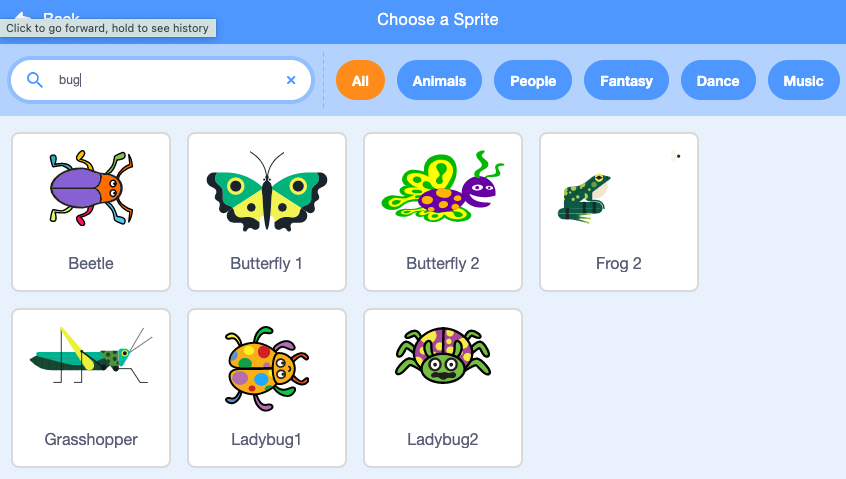

## Start screen

Your game will begin with a start screen, players will click the bug to go to the first level.

{:width="300px"}

--- task ---

Open a [new Scratch project](http://rpf.io/scratch-new){:target="_blank"}. Scratch will open in another browser tab.

[[[working-offline]]]
--- /task ---

--- task ---

Add the **Chalkboard** backdrop from the **Indoors** category.

--- /task ---

The Stage has a **Backdrops** tab instead of a **Costumes** tab. This is where you can paint images for the Stage.

--- task ---
Click on the Stage pane. 

--- /task ---

--- task ---

Click on the **Backdrops** tab to open the Paint editor. 

--- /task ---

--- task ---

Select 'backdrop1' and  click on the trash can to remove it from your project. You won't be using it.

--- /task ---

The 'Chalkboard' backdrop will now be highlighted. 

--- task ---

Click on 'Convert to Vector'. This will allow you to add text that you can move around. 

--- /task ---

--- task ---

Use the Text tool to add the text 'Find the bug' to the Chalkboard:

We used the 'Marker' font in white, but **choose** your favourite.

**Tip:** Switch to the Select (arrow) tool to move your text around. Grab the corner of the text and drag it to change the size.

--- /task ---

--- task ---

Change the name of the backdrop to 'start' because you will be selecting it later in the project.

**Tip:** Using names that make sense will help you understand your project, especially when you come back to a project later.

--- /task ---

--- task ---

Delete the Scratch cat sprite.

--- /task ---

--- task ---

Click on 'Choose a sprite' and type 'bug' into the search. 

**Choose:** Choose a bug for players to find in your game. 

**Tip:** Give your project a name. Maybe it can include the name of the bug you have just chosen?

--- /task ---

A mistake in a computer program is called a bug. Finding and removing mistakes in computer programs is called debugging. Grace Hopper is a famous software engineer. Her team once found a moth in their computer. Their notes say "First actual case of bug being found."

--- save ---

