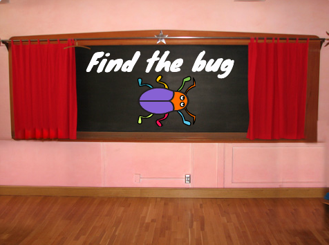

## Create a title screen

Your game will start with a title screen, players will click the bug to start.

--- task ---

Open a [new Scratch project](http://rpf.io/scratch-new){:target="_blank"}. Scratch will open in another browser tab.

--- collapse ---
---
title: Working offline
---
To set up Scratch for offline use visit [our Scratch guide](https://learning-admin.raspberrypi.org/en/projects/getting-started-scratch/1){:target="_blank"}.

--- /collapse ---

--- /task ---

--- task ---

Add the 'Chalkboard' backdrop from the Indoors category.


--- /task ---

The Stage has a Backdrops tab instead of a Costumes tab. This is where you can paint images for the Stage.

--- task ---
Click on the Stage pane. 


--- /task ---

--- task ---

Click on the 'Backdrops' tab to open the Paint editor. 


--- /task ---

--- task ---
Click on 'Convert to Vector'. This will allow you to add text that you can move around. 


--- /task ---

--- task ---

Use the Text tool to add the text 'Find the bug' to the Chalkboard:


We used the 'Marker' font in white, but you can choose.

Tip: Switch to the Select (arrow) tool to move your text around. Grab the corner of the text and drag it to change the size.

--- /task ---


--- task ---

Change the name of the backdrop to 'start' to make it easier to use:


--- /task ---

--- task ---
Delete the Scratch cat sprite.

--- /task ---

--- task ---
Click on 'Choose and sprite' and type 'bug' into the search. Choose a bug for players to find in your game. 


--- /task ---

--- task ---

Drag the bug onto the Chalkboard on the Stage:



--- /task ---

In this project you will be switching backdrops. The bug needs to move to the position you have chosen when the backdrop switches to the Start screen.

--- task ---
Add code to the bug to position on the Chalkboard every time your project switches to the Start screen:


```blocks3
when backdrop switches to [start v]
go to x: [0] y: [30] // on the board
```
--- /task ---

--- save ---
