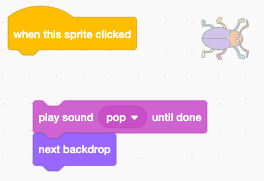

## First level

You will add a new backdrop as the first level in your game and hide the bug. 

{:width="300px"}

--- task ---

Add the 'Spotlight' backdrop from the Music category.


--- /task ---

--- task ---

Click on the bug in the Sprite list. Add a script to change your bug size when the backdrop switches to Spotlight:


```blocks3
when backdrop switches to [Spotlight v]
set size to [20] % // tiny
``` 

--- /task ---

--- task ---

Click on the code to change the size then drag your tiny bug to a hiding place. 

Add code to position your bug:


```blocks3
when backdrop switches to [Spotlight v]
set size to [20] % // tiny
+ go to x: [13] y: [132] // on the disco ball
```

**Choose:** You can choose a different size and location if you prefer. 

--- /task ---

When you are playing the game and you successfully find the bug, the game will switch to the next backdrop. You'll also start the game by clicking on the bug on the Start screen.

The `next backdrop`{:class="block3looks"} block switches to the next backdrop in the order that the backdrops are listed when you click on the Stage pane. 

--- task ---

Add a script to your bug to play a pop sound and switch to the `next backdrop`{:class="block3looks"} when you click on it:


```blocks3
when this sprite clicked
play sound [Pop v] until done
next backdrop
```

--- /task ---

Your project needs to start on the Start screen.

--- task ---

Click on the Stage pane and add this code to the stage:


```blocks3
when flag clicked
switch backdrop to [start v] // start screen
```

--- /task ---

--- task ---

**Test:** Click the green flag to test your project. 

You will notice that on the start screen the bug will still have the settings to hide on the disco ball on the first level.  

**Tip:** After the last backdrop in the list, `next backdrop`{:class="block3looks"} will switch back to the first backdrop.

--- /task ---

--- task ---

Click on the bug sprite. Add a script to set the size of the bug when your project switches to the Start screen:


```blocks3
when backdrop switches to [start v]
set size to [100] % // full size
```

--- /task ---

--- task ---

Try to position the bug on the start screen. 

Your code will make it switch to the next backdrop! That's not helpful when you are trying to position the bug.

--- /task ---

To fix the problem you will need to stop the code from running when you click on the bug.

--- task ---
Click on the green flag to return to the start screen.

Click on the bug sprite and drag the blocks away from the `when this sprite clicked`{:class="block3events"} block:



--- /task ---

--- task ---

Try to position the bug again. Drag the bug onto the Chalkboard below the text: 


Add code to make sure the bug is positioned on the Chalkboard every time your project switches backdrop to the Start screen:


```blocks3
when backdrop switches to [start v]
set size to [100] % // full size
+ go to x: [0] y: [30] // on the board
```

--- /task ---

--- task ---

Join the blocks back together so the code blocks are under the `when this sprite clicked`{:class="block3events"} block.


--- /task ---

--- task ---

**Test:** Click the green flag to test your project. Click on the bug to move to the next backdrop. The bug should be big on the start screen and small on the Spotlight level.

--- collapse ---

---
title: Nothing happens when I click on the bug.
---

Did you forget to join the code back to the `when this sprite clicked`{:class="block3events"} block.

--- /collapse ---

--- /task ---

--- save ---
