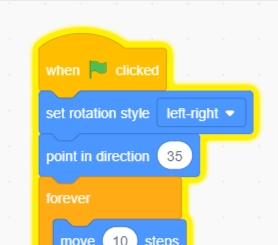

## Parrot distraction

<div style="display: flex; flex-wrap: wrap">
<div style="flex-basis: 200px; flex-grow: 1; margin-right: 15px;">
To make it harder for players to find and click on the bug, you will add an annoying parrot to distract them. 
</div>
<div>

{:width="300px"}

</div>
</div>

### Add the Parrot sprite

--- task ---

Add the **Parrot** sprite. 


--- /task ---

### Animate the Parrot sprite

In the [Catch the bus](https://projects.raspberrypi.org/en/projects/catch-the-bus){:target="_blank"} project, you used a `repeat`{:class="block3control"} loop. 

You will use a different loop here. A `forever`{:class="block3control"} loop runs the code blocks inside it again and again. It is the perfect loop for an annoying parrot that will not stop flying around and getting in the way.

--- task ---

Add code to make the parrot flap around in a distracting way. Look at the comments on the code blocks for some different numbers to try:


```blocks3
when flag clicked
set rotation style [left-right v] // do not go upside down
point in direction [35] // number from -180 to 180
forever // keep being annoying
move [10] steps // the number controls the speed
if on edge, bounce // stay on the Stage
next costume // flap
change [color v] effect by [5] // try 11 or 50
wait [0.25] seconds // try 0.1 or 0.5
end
```

--- /task ---

--- task ---

**Test:** Click on the green flag and test your project again. Can you remember where you hid the bug? 

In Scratch, code that is running glows with a yellow outline:

    

**Tip:** If the parrot gets too annoying while you are coding, you can click the red stop button above the Stage to stop the code from running.

--- /task ---

