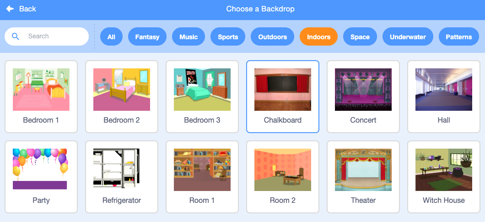

## End screen

Create an end screen to show the number of seconds it has taken to find the bugs. 

<p style="border-left: solid; border-width:10px; border-color: #0faeb0; background-color: aliceblue; padding: 10px;">
Sometimes, just beating a game isn't enough. Players like to know how they did against other players or themselves. Can you think of a game that shows you how well you did?</p>

--- task ---

Add the 'Chalkboard' backdrop from the Indoors category. 



**Tip:** In Scratch you can add the same backdrop more than once.

--- /task ---

--- task ---

Click on the 'Backdrops' tab to open the Paint editor. 


--- /task ---

--- task ---

Change the name of the backdrop to 'end':


**Tip:** Renaming the backdrop to end makes it easier to understand your code. 

--- /task ---

--- task ---
Click on the bug sprite and add code to position the bug on the end screen:


```blocks3
when backdrop switches to [end v]
set size to [100] % // full size
go to x: [0] y: [30] // on the board
```

--- /task ---

How long does it take you to find and click on the bugs? Scratch has a `timer`{:class="block3sensing"} that you can use to find out.

--- task ---

The `timer`{:class="block3sensing"} is in the `Sensing`{:class="block3sensing"} Blocks menu.


```blocks3
when backdrop switches to [end v]
set size to [100] % // full size
go to x: [0] y: [30] // on the board
+say (timer) // seconds taken
```


--- /task ---

--- task ---

**Test:** Click the green flag to test your finding skills. How long does it take you to find a click on the bug?

--- /task ---

You can click on the bug on the end screen to go back to the start screen. 

--- task ---
Add code to make the bug stop saying the timer when you go to the start screen:


```blocks3
when backdrop switches to [start v]
set size to [100] % // full size
go to x: [0] y: [30] // on the board
+say [] // say nothing
```

--- /task ---

If you play the game a second time, the `timer`{:class="block3sensing"} will keep counting. 

--- task ---

Reset the timer when you switch to the first level:


```blocks3
when backdrop switches to [Spotlight v]
set size to [20] % // tiny
go to x: [13] y: [132] // on the disco ball
+reset timer // start the timer
```

--- /task ---

--- task ---

**Test:** Click the green flag and play the game. The timer should reset when you click on the bug on the start screen to move to the first level. When you click on the bug on the end screen you should return to the start screen and see that the bug is not saying the timer. 

--- /task ---

--- save ---
