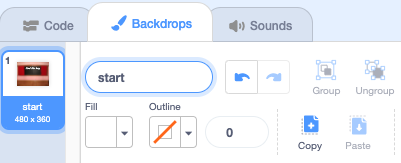

## Add an end screen

Create an end screen to show the number of seconds it has taken to find the bugs. 

--- task ---

Add the 'Chalkboard' backdrop from the Indoors category.


Tip: In Scratch you can add the same backdrop 

--- /task ---

The Stage has a Backdrops tab instead of a Costumes tab. This is where you can paint images for the Stage.

--- task ---

Click on the Stage pane. 


--- /task ---

--- task ---

Click on the 'Backdrops' tab to open the Paint editor. 


--- /task ---

--- task ---

Select 'backdrop1' and  click on the trash can to remove it from your project. You won't be using it.


--- /task ---

--- task ---

The 'Chalkboard' backdrop will now be highlighted. Click on 'Convert to Vector'. This will allow you to add text that you can move around. 


--- /task ---

--- task ---

Use the Text tool to add the text 'Find the bug' to the Chalkboard:


We used the 'Marker' font in white, but you can choose.

Tip: Switch to the Select (arrow) tool to move your text around. Grab the corner of the text and drag it to change the size.

--- /task ---

--- task ---

Change the name of the backdrop to 'start' to make it easier to use:



--- /task ---

How long does it take you to find and click on the bugs? Scratch has a built-in `timer`{:class="block3sensing"} that you can use to find out.

--- task ---

The `timer`{:class="block3sensing"} is in the `Sensing`{:class="block3sensing"} Blocks menu.

```blocks3
when backdrop switches to [end v]
go to x: [-75] y: [30] // on the board
set size to [100] % // full size
say (timer) // seconds taken
```

--- /task ---

--- task ---

**Test:** Click the green flag to test your finding skills. How long does it take you to find a click on the bug?

--- /task ---

You can click on the bug on the end screen to go back to the start screen. 

--- task ---
Add code to make the bug stop saying the timer when you go to the start screen:

```blocks3
when backdrop switches to [start v]
go to x: [0] y: [30] // on the board
set size to [100] % // full size
+say [] // say nothing
```

--- /task ---

--- task ---

If you play the game a second time, the `timer`{:class="block3sensing"} will keep counting. 

--- task ---

Reset the timer when you switch to the first level:

```blocks3
when backdrop switches to [Spotlight v]
+reset timer // start the timer
set size to [20] % // tiny
go to x: [13] y: [132] // on the disco ball
```

--- /task ---

--- task ---

**Test:** Click the green flag and make sure the timer resets and the bug doesn't show the time when you return to the start screen.

--- /task ---

--- save ---
