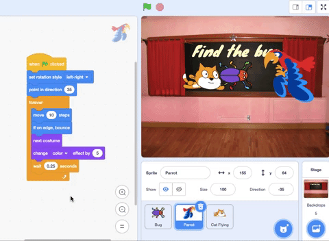

## Upgrade your game

If you have time, you can add more levels and more distractions to your game. You could also change the sprite that is hiding and change the text on the chalkboard. 

Here are the blocks that you will need to hide the bug on a new level:

```blocks3
when backdrop switches to [new level v]

set size to [20] %

go to x: [0] y: [0] // drag to position the bug first

set [color v] effect to [50]
```

--- task ---

For each level, you will need to:
- Add a backdrop
- Click on the Stage pane, then on the **Backdrops** tab, then drag the new backdrop into position before the **end** backdrop
- Add a `when backdrop switches to`{:class="block3events"} block for the new backdrop and add code to position and hide the bug 

**Tip:** To drag the bug to a new hiding position, you will need to 'break' the code so that the backdrop does not switch when you click on the bug to position it for a new level.

--- /task ---

--- task ---

You could add more parrots or choose another sprite to act as a distraction. 

Here is the code that you used for the parrot:
```blocks3
when flag clicked
set rotation style [left-right v] // do not go upside down
point in direction [35] // number from -180 to 180
forever // keep being annoying
move [10] steps // the number controls the speed
if on edge, bounce // stay on the Stage
next costume // flap
change [color v] effect by [5] // try 11 or 50
wait [0.25] seconds // try 0.1 or 0.5
end
```

**Tip:** You can drag the **Parrot** sprite's code to another sprite to make it faster to create another distraction sprite.



--- /task ---

--- collapse ---
---
title: Completed project
---

You can view the [completed project here](https://scratch.mit.edu/projects/486719939/){:target="_blank"}.

--- /collapse ---

--- save ---

