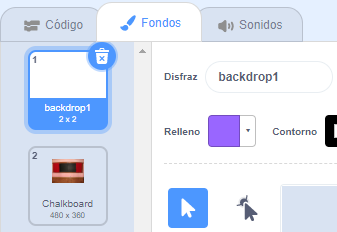

## Pantalla de inicio

Dale a tu juego una pantalla de "inicio".

{:width="300px"}

### Abre el proyecto inicial

--- task ---

Abre el [proyecto de inicio de Encuentra el insecto](https://scratch.mit.edu/projects/582214723/editor){:target="_blank"}. Scratch se abrirá en otra pestaña del navegador.

[[[working-offline]]]

--- /task ---

### Agrega un fondo

--- task ---

Agrega el fondo **Chalkboard** de la categoría **Interiores**.

--- /task ---

El **Escenario** tiene una pestaña de **Fondos** en lugar de una pestaña de **Disfraces**. Aquí es donde puedes crear imágenes para el **Fondo**.

--- task ---

Haz clic en el panel Escenario.

--- /task ---

### Edita el Fondo

--- task ---

Haz clic en la pestaña **Fondos** para abrir el editor de dibujo.

--- /task ---

--- task ---

Selecciona **backdrop1** y haz clic en el ícono **Eliminar** para eliminar el fondo **** de tu proyecto. No necesitarás el fondo **backdrop1** en este proyecto.

--- /task ---

Ahora el fondo **Pizarra** estará resaltado.

--- task ---

Haz clic en **Convertir a vector**. Ahora, podrás agregar texto que puedes mover.

--- /task ---

--- task ---

Usa la herramienta **Texto** para agregar el texto `Encuentra el insecto` en la pizarra:

Hemos usado la fuente **Marker** en color blanco, pero puedes **elegir** la fuente y color que quieras usar.

**Consejo:** Cambia a la herramienta **Seleccionar** (Flecha) para mover el texto. Para cambiar el tamaño del texto, toma la esquina del texto y arrástralo.

--- /task ---

## Cambia el nombre del Fondo

--- task ---

Cambia el nombre del fondo a `inicio`, ya que necesitarás seleccionarlo más adelante en el proyecto.

**Consejo:** Si usas nombres que tengan sentido, será más fácil entender tu proyecto, especialmente cuando regreses a un proyecto más tarde.

--- /task ---

### Agrega el Objeto Error

--- task ---

Elimina el objeto **Gato de Scratch**.

--- /task ---

--- task ---

Haz clic en **Elegir un objeto** y escribe `bug` en el cuadro de búsqueda.

**Elige:** Elige un insecto que los jugadores tendrán que encontrar en su juego.

**Consejo:** Ponle nombre a tu proyecto. Tal vez quieras incluir el el nombre del insecto que has elegido.

--- /task ---

Un error en un programa de computadora se llama  un **bug** (insecto). Encontrar y eliminar errores en programas informáticos se denomina **debugging**. Grace Hopper es una famosa ingeniera de software. Su equipo una vez encontró una polilla en su computadora. En sus notas dice: "Primer caso real de un insecto encontrado."

