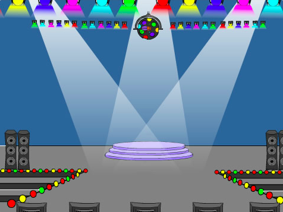
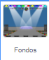
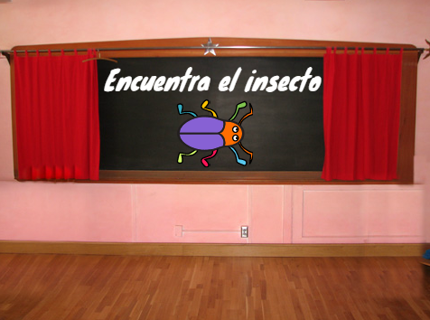
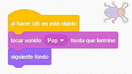

## Primer nivel

<div style="display: flex; flex-wrap: wrap">
<div style="flex-basis: 200px; flex-grow: 1; margin-right: 15px;">
Agregarás un nuevo fondo como primer nivel en tu juego y ocultarás el insecto.
</div>
<div>

{:width="300px"}

</div>
</div>

--- task ---

Agrega el fondo **Spotlight** de la categoría **Música**.


--- /task ---

--- task ---

Haz clic en el objeto **insecto** en la lista de Objetos. Añade un script cambiar el `tamaño`{:class="block3looks"} de tu insecto `cuando el fondo cambie a Spotlight`{:class="block3events"}:


```blocks3
when backdrop switches to [Spotlight v]
set size to [20] % // tiny
```

--- /task ---

--- task ---

Haz clic en el código para cambiar el tamaño, luego arrastra tu pequeño insecto a un escondite.

Añade código para posicionar tu insecto:


```blocks3
when backdrop switches to [Spotlight v]
set size to [20] % // tiny
+ go to x: [13] y: [132] // on the disco ball
```

**Elige:** Puedes elegir un tamaño y una ubicación diferentes, si lo prefieres.

--- /task ---

Cuando juegas y encuentras con éxito el insecto, el juego cambiará al siguiente fondo. Además, para iniciar el juego, harás clic en el error en la pantalla de "inicio".

El bloque `siguiente fondo`{:class="block3looks"} cambia al siguiente fondo en el orden en que se enumeran los fondos cuando haces clic en la pestaña **Fondos** para el **Escenario**.

--- task ---

Añade un script a tu objeto **insecto** para `reproducir un sonido Pop`{:class="block3sound"} y cambiar al `siguiente fondo`{:class="block3looks"} `al hacer clic en este objeto`{:class="block3events"}:


```blocks3
when this sprite clicked
play sound [Pop v] until done
next backdrop
```

--- /task ---

Tu proyecto debe comenzar en la pantalla de 'inicio'.

--- task ---

Haz clic en el panel Escenario y agrega este código al **Escenario**:



```blocks3
when flag clicked
switch backdrop to [start v] // 'start' screen
```

--- /task ---

--- task ---

**Prueba:** Haz clic en la bandera verde para probar tu proyecto.

Notarás que en la pantalla de 'inicio', el insecto aún tendrá la configuración para esconderse en su escondite del primer nivel (en este ejemplo, en la bola de discoteca).

**Consejo:** Después del último fondo de la lista, `siguiente fondo`{:class="block3looks"} volverá al primer fondo.

--- /task ---

--- task ---

Haz clic en el objeto **insecto** en la lista de Objetos. Añade un script para `fijar el tamaño`{:class="block3looks"} del insecto cuando tu `fondo cambia a`{:class="block3events"} la pantalla de `inicio`{:class="block3events"}:


```blocks3
when backdrop switches to [start v]
set size to [100] % // full-sized
```

--- /task ---

--- task ---

Intenta colocar el insecto en la pantalla de 'inicio'.

¡Tu código hará que el fondo cambie cuando hagas clic en el insecto! Eso no es útil cuando intentas posicionar el insecto.

--- /task ---

Para solucionar el problema, debes detener la ejecución del código cuando hagas clic en el insecto.

--- task ---

Haz clic en la bandera verde para volver a la pantalla de 'inicio'.

Haz clic en el objeto **insecto** en la lista de Objetos y arrastra los bloques lejos del bloque `al hacer clic en este objeto`{:class="block3events"}:


--- /task ---

--- task ---

Intenta posicionar el insecto nuevamente. Arrastra el insecto a la pizarra, debajo del texto:



Añade código para asegurarte de que el insecto se posicione en la pizarra cada vez que tu `fondo cambia a`{:class="block3events"} la pantalla de `inicio`{:class="block3events"}:


```blocks3
when backdrop switches to [start v]
set size to [100] % // full-sized
+ go to x: [0] y: [30] // on the board
```

--- /task ---

--- task ---

Vuelve a unir los bloques para que los bloques de código estén debajo del bloque `al hacer clic en este objeto`{:class="block3events"} nuevamente:



--- /task ---

--- task ---

**Prueba:** Haz clic en la bandera verde para probar tu proyecto. Haz clic en el insecto para pasar al siguiente fondo. El insecto debería ser grande en la pantalla de 'inicio' y pequeño en el nivel de 'Spotlight'.

--- collapse ---
---
title: No pasa nada cuando hago clic en el insecto
---

¿Olvidaste volver a unir el código al bloque `al hacer clic en este objeto`{:class="block3events"}?

--- /collapse ---

--- /task ---

--- save ---
