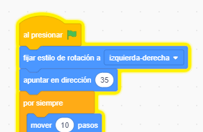

## Loro para distraer

<div style="display: flex; flex-wrap: wrap">
<div style="flex-basis: 200px; flex-grow: 1; margin-right: 15px;">
Para que sea más difícil para los jugadores encontrar y hacer clic en el insecto, agregarás un loro molesto para distraerlos. 
</div>
<div>

{:width="300px"}

</div>
</div>

### Agrega el objeto Loro (Parrot)

--- task ---

Añade el objeto **Parrot**.


--- /task ---

### Anima el objeto Loro (Parrot)

En el proyecto [Tomar el autobús](https://projects.raspberrypi.org/es-LA/projects/catch-the-bus){:target="_blank"}, usaste un bucle `repetir`{:class="block3control"}.

quí utilizarás un bucle diferente. Un bucle `por siempre`{:class="block3control"} ejecuta los bloques de código dentro de él una y otra vez. Es perfecto para un loro molesto que no para de volar y estorbar.

--- task ---

Añade código para hacer que el loro se mueva de una manera que distraiga:


```blocks3
when flag clicked
set rotation style [left-right v] // no va boca abajo
point in direction [35] // número de -180 a 180
forever // sigue siendo molesto
move [10] steps // el número controla la velocidad
if on edge, bounce // permanecer en el Escenario
next costume // aletear
change [color v] effect by [5] // prueba 11 o 50
wait [0.25] seconds // prueba 0.1 o 0.5
end
```

--- /task ---

--- task ---

**Prueba:** Haz clic en la bandera verde y prueba tu proyecto otra vez. ¿Recuerdas dónde escondiste el insecto?

En Scratch, el código que se está ejecutando se ilumina con un contorno amarillo:



**Consejo:** Si el loro se vuelve demasiado molesto mientras codificas, puedes hacer clic en el botón rojo de parada que se encuentra sobre el escenario para detener la ejecución del código.

--- /task ---
