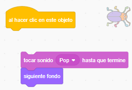
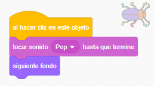

## Segundo nivel

<div style="display: flex; flex-wrap: wrap">
<div style="flex-basis: 200px; flex-grow: 1; margin-right: 15px;">
Elegirás un fondo para crear un segundo nivel en tu juego y hacer que el insecto sea difícil de encontrar. 
</div>
<div>

{:width="300px"}

</div>
</div>

### Agrega otro fondo

--- task ---

**Elige:** Elige un fondo para tu segundo nivel. Hemos elegido **Urban**, pero puedes elegir el que más te guste.


**Consejo:** Recuerda que los fondos con muchos colores y detalles harán que el insecto sea más difícil de encontrar. ¿Qué tan difícil harás tu juego?

--- /task ---

### Detén la ejecución del código

--- task ---

Arrastra los bloques lejos del bloque `al hacer clic en este objeto`{:class="block3events"} para evitar que se ejecuten cuando hagas clic en el insecto:



--- /task ---

### Redimensiona el insecto

--- task ---

Añade código a `fijar el tamaño`{:class="block3looks"} del insecto para el segundo nivel:


```blocks3
when backdrop switches to [Urban v] // elige tu fondo
set size to [20] % // prueba otro tamaño 
```

**Prueba:** Haz clic en tu nuevo script para ejecutarlo.

--- /task ---

### Oculta tu insecto

--- task ---

Arrástralo en el escenario a un buen escondite para este nivel.


--- /task ---

Posiciona el insecto en su escondite.

--- task ---

Agrega un bloque `ir a x: y:`{:class="block3motion"} a tu código:


```blocks3
when backdrop switches to [Urban v]
set size to [20] % // prueba otro tamaño 
+ go to x: [24] y: [13] // en el escaparate
```

--- /task ---

### Prueba tu código

--- task ---

Vuelve a unir los bloques al bloque `al hacer clic en este objeto`{:class="block3events"} para que cuando se haga clic en el insecto, se cambie al `siguiente fondo`{:class="block3looks"}:



--- /task ---

--- task ---

**Prueba:** Haz clic en la bandera verde para probar tu proyecto.

--- /task ---

Tu insecto puede estar frente al loro ahora.

--- task ---

Añade un script para asegurarte de que esté siempre `atrás`{:class="block3looks"}:


```blocks3
when flag clicked
forever
go to [back v] layer
```

Ahora, tu insecto siempre permanecerá atrás, incluso si necesitas cambiar su posición.

--- /task ---
