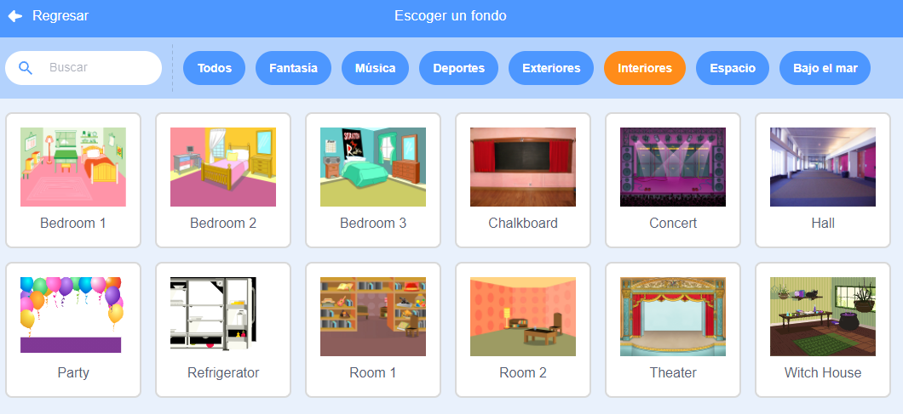
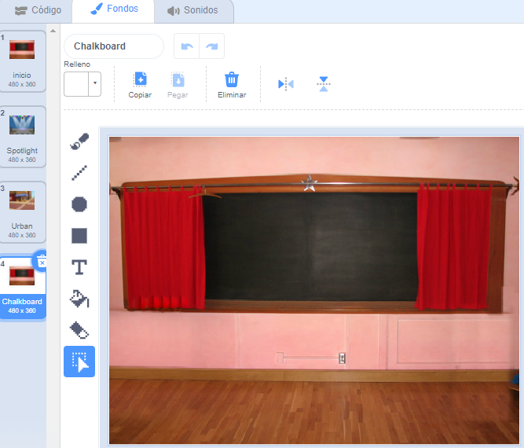
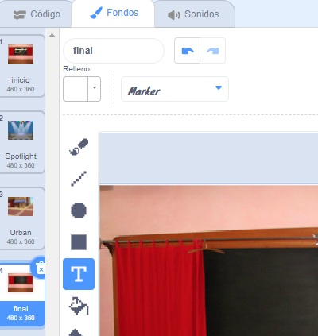
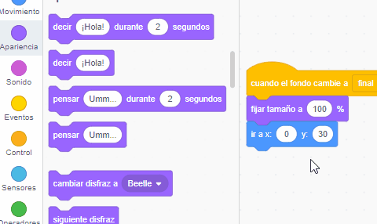

## Pantalla final

<div style="display: flex; flex-wrap: wrap">
<div style="flex-basis: 200px; flex-grow: 1; margin-right: 15px;">
Crearás una pantalla 'final' para mostrar la cantidad de segundos que le ha tomado al jugador encontrar los insectos. 
</div>
<div>

{:width="300px"}

</div>
</div>

<p style="border-left: solid; border-width:10px; border-color: #0faeb0; background-color: aliceblue; padding: 10px;">
A veces, tan solo ganar un juego no es suficiente. A los jugadores les gusta saber cómo les fue contra otros jugadores o contra ellos mismos. ¿Puedes pensar en un juego que te muestre lo bien que lo hiciste?</p>

--- task ---

Agrega el fondo **Chalkboard** de la categoría **Interiores**.



**Consejo:** En Scratch, puedes agregar el mismo fondo más de una vez.

--- /task ---

--- task ---

Haz clic en la pestaña **Fondos** para abrir el editor de dibujo.



--- /task ---

--- task ---

Cambia el nombre del fondo a `final`:



**Consejo:** Se cambia el nombre del fondo a **final** para que tu código sea más fácil de entender.

--- /task ---

--- task ---

Haz clic en el objeto **insecto** y añade código para posicionar el insecto en la pantalla 'final':


```blocks3
when backdrop switches to [end v]
set size to [100] % // full-sized
go to x: [0] y: [30] // on the board
```

--- /task ---

¿Cuánto tiempo te lleva encontrar y hacer clic en los insectos? Scratch tiene un cronómetro ``{:class="block3sensing"} que puedes usar para averiguarlo.

--- task ---

El bloque `cronómetro`{:class="block3sensing"} está en el menú de bloques `Sensores`{:class="block3sensing"}. Añade código para hacer al insecto `decir`{:class="block3looks"} el `cronómetro`{:class="block3sensing"} en la pantalla 'final':


```blocks3
when backdrop switches to [end v]
set size to [100] % // full-sized
go to x: [0] y: [30] // on the board
+say (timer) // seconds taken
```



--- /task ---

--- task ---

**Prueba:** Haz clic en la bandera verde para probar tus habilidades de búsqueda. ¿Cuánto tiempo tardas en encontrar el insecto?

--- /task ---

Para volver a la pantalla de 'inicio', haz clic en el insecto en la pantalla 'final'.

--- task ---

Añade código para que el insecto deje de decir el `cronómetro`{:class="block3sensing"} cuando vayas a la pantalla de 'inicio':


```blocks3
when backdrop switches to [start v]
set size to [100] % // full-sized
go to x: [0] y: [30] // on the board
+say [] // say nothing
```

--- /task ---

Si juegas el juego por segunda vez, el `cronómetro`{:class="block3sensing"} seguirá contando.

--- task ---

Añade código para `reiniciar el cronómetro`{:class="block3sensing"} cuando el `fondo cambie al`{: class = "block3events"} primer nivel:


```blocks3
when backdrop switches to [Spotlight v] // first level
set size to [20] % // tiny
go to x: [13] y: [132] // on the disco ball
+reset timer // start the timer
```

--- /task ---

--- task ---

**Prueba:** Haz clic en la bandera verde y juega el juego. El cronómetro debería reiniciarse cuando hagas clic en el insecto en la pantalla de 'inicio' para pasar al primer nivel. Al hacer clic en el insecto en la pantalla 'final', debes volver a la pantalla 'inicio' y ver que el insecto no diga el `cronómetro`{:class="block3sensing"}.

--- /task ---

--- save ---
