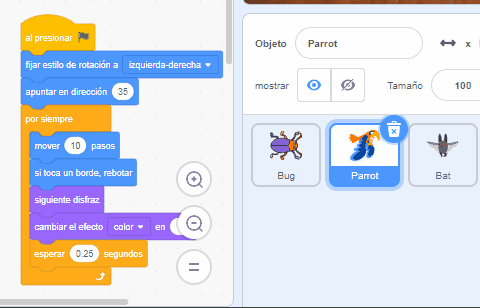

## Mejora tu juego

Si tienes tiempo, puedes agregar más niveles y más distracciones a tu juego. También puedes cambiar el objeto que se esconde y cambiar el texto en la pizarra.

--- task ---

Juega tu juego y mira qué tan rápido puedes encontrar los insectos.

¿Hay alguien más que pueda probar tu juego? ¿Qué tan rápido pueden encontrar los insectos? No sabrán dónde los has escondido, ¡así que puede que les lleve un poco más de tiempo!

¿Hay algo que quieras cambiar?

Podrías:
- Hacer que el loro sea aún más molesto
- Hacer los insectos más pequeños
- Cambiar el `efecto color`{:class="block3looks"} para camuflar el insecto en cada nivel
- Cambiar la fuente o el color del texto

--- /task ---

### Agrega más niveles

--- task ---

Estos son los bloques que necesitarás para ocultar el insecto en un nuevo nivel:

```blocks3
when backdrop switches to [new level v]

set size to [20] %

go to x: [0] y: [0] // drag to position the bug first

set [color v] effect to [50]
```

Para cada nivel necesitarás:
- Agregar un fondo
- Hacer clic en el panel Escenario, luego en la pestaña **Fondos**, luego arrastrar el nuevo fondo a la posición antes del fondo **final**
- Agregar un bloque `cuando el fondo cambie a`{:class="block3events"} para el nuevo fondo y añadir código para posicionar y ocultar el insecto

**Consejo:** Para arrastrar el insecto a un nuevo escondite, tendrás que "romper" el código para que el fondo no cambie cuando hagas clic en el insecto para posicionarlo en un nuevo nivel.

--- /task ---

### Añade más distracciones

--- task ---

Puedes agregar más loros o elegir otro objeto para que actúe como distracción.

Aquí está el código que usaste para el loro:

```blocks3
when flag clicked
set rotation style [left-right v] // do not go upside down
point in direction [35] // number from -180 to 180
forever // keep being annoying
move [10] steps // the number controls the speed
if on edge, bounce // stay on the Stage
next costume // flap
change [color v] effect by [5] // try 11 or 50
wait [0.25] seconds // try 0.1 or 0.5
end
```

**Consejo:** Puedes arrastrar el código del objeto **Parrot** a otro objeto para que sea más rápido crear otro objeto de distracción.



--- /task ---

--- collapse ---
---
title: Proyecto terminado
---

Puedes ver el [proyecto terminado aquí](https://scratch.mit.edu/projects/486719939/){:target="_blank"}.

--- /collapse ---