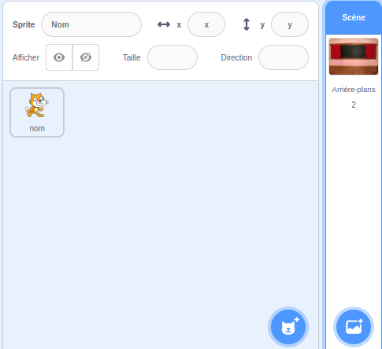

## Écran de début

Ton jeu commencera par un écran de « début » et les joueurs cliqueront sur le bug pour passer au premier niveau.

{:width="300px"}

--- task ---

Ouvre le [projet de démarrage Trouver le bug](https://scratch.mit.edu/projects/582214723/editor){:target="_blank"}. Scratch s'ouvrira dans un autre onglet du navigateur.

[[[working-offline]]]

--- /task ---

--- task ---

Ajoute le **Chalkboard** de la catégorie **Indoors**.

--- /task ---

La **Scène** a un onglet **Arrière-plans** au lieu d'un onglet **Costumes**. C'est ici que tu peux créer des images pour la **Scène**.

--- task ---

Clique sur le volet Scène.

--- /task ---

--- task ---

Clique sur l'onglet **Arrière-plans** pour ouvrir l'éditeur de peinture.

--- /task ---

--- task ---

Sélectionne **arrière-plan1** et clique sur l'icone **Supprimer** pour supprimer l'**arrière-plan1** de ton projet. Tu n'auras pas besoin de l'**arrière-plan1** dans ce projet.

--- /task ---

Le **Chalkboard** sera maintenant mis en surbrillance.

--- task ---

Clique sur **Convertir en vecteur**. Maintenant, tu pourras ajouter du texte que tu pourras déplacer.

--- /task ---

--- task ---

Utilise l' outil **Texte** pour ajouter le texte `Trouver le bug` au tableau :

Nous avons utilisé la police **Marker** en blanc, mais **choisis** la police et la couleur que tu souhaites utiliser.

**Astuce :** Passe à l'outil **Sélectionner** (Flèche) pour déplacer ton texte. Pour modifier la taille du texte, saisis le coin du texte et fais-le glisser.

--- /task ---

--- task ---

Change le nom de l'arrière-plan en `début`, car tu devras le sélectionner plus tard dans le projet.

**Astuce :** Si tu utilises des noms qui ont du sens, il sera plus facile de comprendre ton projet, surtout lorsque tu reviendras sur un projet plus tard.

--- /task ---

--- task ---

Supprime le sprite **Scratch Cat**.

--- /task ---

--- task ---

Clique sur **Choisir un Sprite** et tape `bug` dans le champ de recherche.

**Choisir :** Choisis un bug que les joueurs devront trouver dans ton jeu.

**Astuce :** Donne un nom à ton projet. Tu peux inclure le nom du bug que tu viens de choisir.

--- /task ---

Une erreur dans un programme informatique est appelée un **bug**. La recherche et la suppression des erreurs dans les programmes informatiques s'appellent **débogage**. Grace Hopper est une célèbre ingénieure en logiciel. Son équipe a une fois trouvé un papillon de nuit dans leur ordinateur. Leurs notes disent : « Premier cas réel de bogue détecté. »

--- save ---

