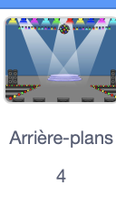
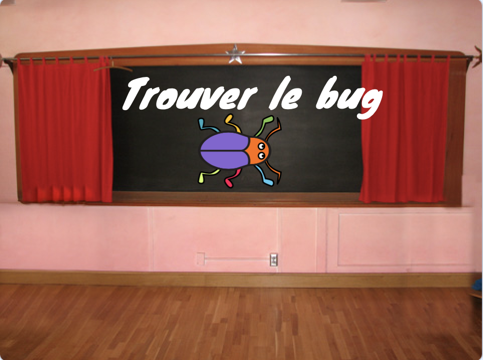

## Premier niveau

<div style="display: flex; flex-wrap: wrap">
<div style="flex-basis: 200px; flex-grow: 1; margin-right: 15px;">
Tu ajouteras un nouvel arrière-plan au premier niveau de ton jeu et masqueras le bug.
</div>
<div>

{:width="300px"}

</div>
</div>

--- task ---

Ajoute le **Spotlight** de la catégorie **Music**.


--- /task ---

--- task ---

Clique sur le sprite **bug** dans la liste Sprite. Ajoute un script pour changer la `taille`{:class="block3looks"} de ton bug `quand l'arrière-plan bascule sur projecteur`{:class="block3events"} :


```blocks3
when backdrop switches to [Spotlight v]
set size to [20] % // tiny
```

--- /task ---

--- task ---

Clique sur le code pour changer la taille, puis fais glisser ton petit bug vers une cachette.

Ajoute du code pour positionner ton bug :


```blocks3
when backdrop switches to [Spotlight v]
set size to [20] % // tiny
+ go to x: [13] y: [132] // on the disco ball
```

**Choisir :** Tu peux choisir une taille et un emplacement différents, si tu préféres.

--- /task ---

Lorsque tu joues au jeu et que tu trouves le bug avec succès, le jeu passe à l'arrière-plan suivant. De plus, pour démarrer le jeu, tu devras cliquer sur le bug sur l'écran « début ».

Le bloc `arrière-plan suivant`{:class="block3looks"} passe au prochain arrière-plan dans l'ordre dans lequel les arrière-plans sont listés lorsque tu cliques sur l'onglet **arrière-plans** pour la **scène**.

--- task ---

Ajoute un script à ton sprite **bug** pour `jouer le son Pop`{:class="block3sound"} et passer à l'`arrière-plan suivant`{:class="block3looks"} `quand ce sprite est cliqué`{:class ="block3events"} :


```blocks3
when this sprite clicked
play sound [Pop v] until done
next backdrop
```

--- /task ---

Ton projet doit démarrer sur l'écran « début ».

--- task ---

Clique sur le volet Scène et ajoute ce code à la **Scène**:



```blocks3
when flag clicked
switch backdrop to [start v] // 'start' screen
```

--- /task ---

--- task ---

**Test :** Clique sur le drapeau vert pour tester ton projet.

Tu remarqueras que sur l'écran 'début', le bug aura toujours les paramètres pour se cacher dans sa cachette du premier niveau (dans cet exemple, sur la boule disco).

**Astuce :** Après le dernier arrière-plan de la liste, `arrière-plan suivant`{:class="block3looks"} reviendra au premier arrière-plan.

--- /task ---

--- task ---

Clique sur le sprite **bug** dans la liste Sprite. Ajoute un script à `mettre à la taille`{:class="block3looks"} du bug lorsque tu `bascules sur l'arrière-plan/0>{:class="block3events"} <code>début`{:class="block3events"} :


```blocks3
when backdrop switches to [start v]
set size to [100] % // full-sized
```

--- /task ---

--- task ---

Essaye de positionner le bug sur l'écran 'début'.

Ton code fera basculer l'arrière-plan lorsque tu cliqueras sur le bug ! Cela n'est pas utile lorsque tu essaies de positionner le bogue.

--- /task ---

Pour résoudre le problème, tu dois arrêter l'exécution du code lorsque tu cliques sur le bug.

--- task ---

Clique sur le drapeau vert pour revenir à l'écran « début ».

Clique sur le sprite **bug** dans la liste Sprite et fais glisser les blocs loin du bloc `quand ce sprite est cliqué `{:class="block3events"} :


--- /task ---

--- task ---

Essaye à nouveau de positionner le bug. Fais glisser le bug sur le tableau, sous le texte :



Ajoute du code pour t'assurer que le bogue est positionné sur le tableau à chaque fois que ton `basculer l'arrière-plan sur`{:class="block3events"} ` début`{:class="block3events"} :


```blocks3
when backdrop switches to [start v]
set size to [100] % // full-sized
+ go to x: [0] y: [30] // on the board
```

--- /task ---

--- task ---

Regroupe les blocs afin que les blocs de code soient sous le bloc `quand ce sprite est cliqué `{:class="block3events"}  à nouveau :


--- /task ---

--- task ---

**Test :** Clique sur le drapeau vert pour tester ton projet. Clique sur le bug pour passer à l'arrière-plan suivant. Le bug devrait être grand sur l'écran « début » et petit sur le niveau « projecteur ».

--- collapse ---
---
title: Rien ne se passe quand je clique sur le bug
---

As-tu oublié de joindre le code au bloc `quand ce sprite est cliqué` {:class="block3events"} ?

--- /collapse ---

--- /task ---

--- save ---
